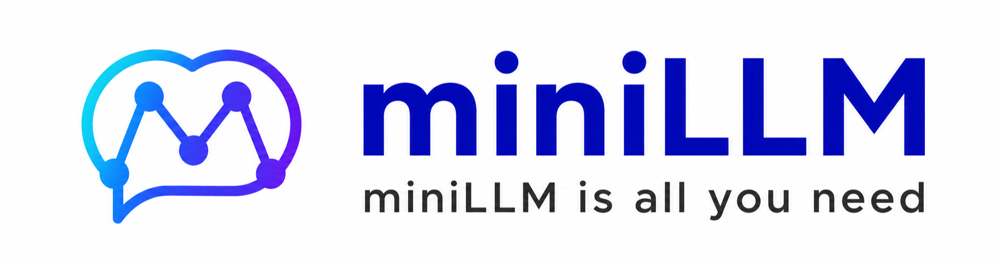
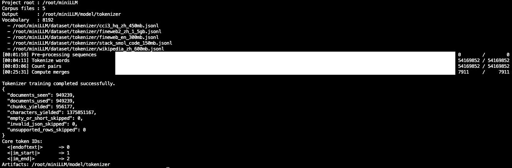
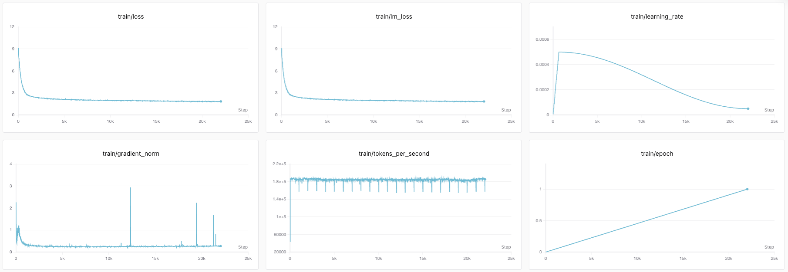
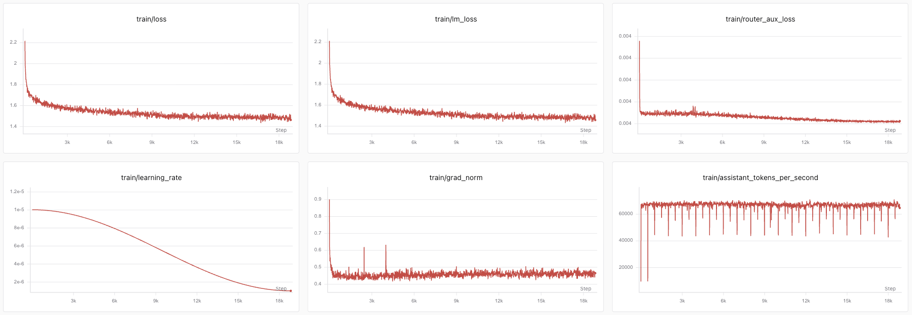
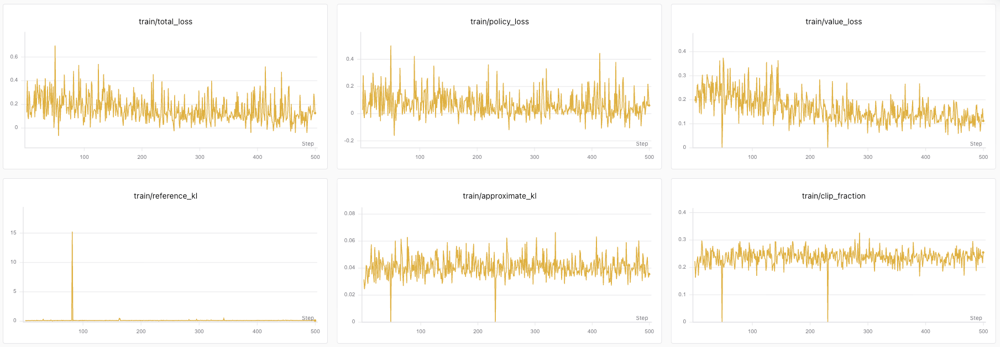
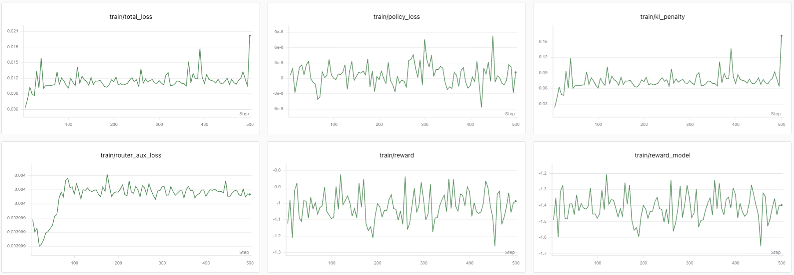

### Build and train a small language model from scratch

[中文](README.md) | English

🚀 [**Try the miniLLM model online**](https://www.modelscope.cn/studios/kayson2026/miniLLM)

👁️ [**Try the miniLLM-vlm vision model online**](https://www.modelscope.cn/studios/kayson2026/miniLLM-vlm)

---

## 🎯 Vision

miniLLM is a language-model project for learning, research, and hands-on experimentation.

The project aims to turn language models from black boxes that can merely be called into engineering systems that can be understood layer by layer. It starts with raw corpora and tokenization, then progresses through pretraining, instruction tuning, preference alignment, reinforcement learning, tool use, and visual extensions, covering the main lifecycles of modern language and multimodal models.

miniLLM pairs its implementation with Chinese and English theory articles and practical guides. Every training stage is intended to be readable, reproducible, comparable, and extensible.

Learning materials:

- Concepts · What an LLM is and why a base model is not an assistant ([中文](%E5%AD%A6%E4%B9%A0%E8%B5%84%E6%96%99%20-%20%E4%BB%8E0%E5%BC%80%E5%A7%8B%E6%9E%84%E5%BB%BALLM/%E8%AE%A4%E7%9F%A5%E7%AF%87/LLM%E5%85%A5%E9%97%A8%EF%BC%9A%E4%BB%8E%E2%80%9C%E4%BA%92%E8%81%94%E7%BD%91%E5%8E%8B%E7%BC%A9%E5%8C%85%E2%80%9D%E5%88%B0%E6%96%B0%E5%9E%8BOS.md) · [English](Learning%20Materials%20-%20Building%20an%20LLM%20from%20Scratch/Concepts/Introduction%20to%20LLMs%20-%20From%20an%20Internet%20Archive%20to%20a%20New%20OS.md))

## 🖥️ Start with One GPU, Learn by Training

**This project is trained on a single NVIDIA GeForce RTX 4090 GPU.** You do not need to start with a multi-GPU cluster to gain hands-on experience with language-model training and understand how data, model architecture, and parameter updates work together.

miniLLM aims to lower the compute barrier to hands-on learning: start with a small dataset and a short training run, then scale up gradually. Memory requirements and runtime vary by stage, so adjust batch size, sequence length, and sampling scale to your resources. Single-GPU training does not mean every stage runs unchanged with its default configuration or that full training has no time cost.

Learning materials:

- Architecture · Compute, memory, and training-efficiency trade-offs ([中文](%E5%AD%A6%E4%B9%A0%E8%B5%84%E6%96%99%20-%20%E4%BB%8E0%E5%BC%80%E5%A7%8B%E6%9E%84%E5%BB%BALLM/%E6%9E%B6%E6%9E%84%E7%AF%87/%E5%A4%A7%E6%A8%A1%E5%9E%8B%E4%BC%98%E5%8C%96%E6%96%B9%E6%B3%95%E8%A7%A3%E6%9E%90.md) · [English](Learning%20Materials%20-%20Building%20an%20LLM%20from%20Scratch/Architecture/LLM%20Optimization%20Methods%20Explained.md))

## ✨ What Is Included

- An 8,192-token ByteLevel-BPE tokenizer that can be trained from scratch
- A decoder-only Transformer built with RMSNorm, RoPE, GQA, and SwiGLU
- Dense and sparse MoE variants, with 4-expert Top-1 routing as the default
- miniLLM-vlm, a visual extension built from the miniLLM Base model and a SigLIP vision encoder
- Pretraining, full-parameter SFT, LoRA, and offline black-box distillation
- DPO, PPO, GRPO, and multi-turn Agentic RL
- Checkpoint resume, mixed precision, gradient accumulation, gradient checkpointing, and compilation
- SwanLab and Weights & Biases experiment tracking
- Evaluation for the tokenizer, pretrained model, SFT, DPO, and PPO stages
- Paired Chinese and English LLM learning materials

## 🧭 First: What Does a Model Actually Learn?

Consider the question “What is in this picture?” Tokenization turns the words into IDs; language pretraining teaches continuation; SFT provides demonstrations of answering; DPO compares better and worse answers; PPO / GRPO let the model generate answers, receive scores, and improve; a VLM additionally supplies image information so that answers can be grounded in what is visible.

Training changes numerical model parameters, also called weights. A typical update follows these steps:

| Step | What happens | Terms to understand |
| --- | --- | --- |
| Prepare data | Organize text or image-text samples and identify the positions to learn from | Batch: samples processed together; token: a unit of tokenized text |
| Forward pass | Calculate next-token probabilities, or recalculate probabilities of sampled answers | Forward: compute outputs using current parameters |
| Calculate the objective | Use target answers, preferences, or rewards to measure how outputs should improve | Loss: the numerical optimization objective; reward: a score for generated behavior |
| Backpropagate | Calculate how parameter changes would affect the loss | Gradient: a derivative guiding parameter updates |
| Update parameters | Apply the optimizer using gradients and a learning rate | Learning rate: update step size; frozen parameters are not updated |
| Validate and save | Check data not used for updates and save resumable training state | Validation: check generalization; checkpoint: saved training state |

An epoch is one pass through the training set. Gradient accumulation processes several small batches before a single update, so the number of batches need not equal the number of optimizer steps. Lower training loss shows better fit to the training objective; validation and actual responses are still needed to assess capability.

Learning materials:

- Concepts · Connect data, training, and inference ([中文](%E5%AD%A6%E4%B9%A0%E8%B5%84%E6%96%99%20-%20%E4%BB%8E0%E5%BC%80%E5%A7%8B%E6%9E%84%E5%BB%BALLM/%E8%AE%A4%E7%9F%A5%E7%AF%87/LLM%E5%85%A8%E6%A0%88%E5%8E%9F%E7%90%86%EF%BC%9A%E4%BB%8E%E6%95%B0%E6%8D%AE%E3%80%81%E8%AE%AD%E7%BB%83%E5%88%B0%E6%8E%A8%E7%90%86.md) · [English](Learning%20Materials%20-%20Building%20an%20LLM%20from%20Scratch/Concepts/Full-Stack%20LLM%20Fundamentals%20-%20From%20Data%20and%20Training%20to%20Inference.md))

## 🧠 Model Architecture

miniLLM is an autoregressive decoder-only causal language model. Sparse MoE is enabled by default, while a dense variant is retained for controlled comparisons.

| Configuration | Default |
| --- | ---: |
| Vocabulary size | 8,192 |
| Hidden size | 768 |
| Decoder layers | 8 |
| Query heads / KV heads | 8 / 4 |
| Head dimension | 96 |
| FFN / expert intermediate size | 2,432 |
| Maximum position configuration | 32,768 |
| Normalization | RMSNorm |
| Position encoding | RoPE |
| Attention | Grouped Query Attention |
| Feed-forward network | SwiGLU |
| Default routing | 4 experts / Top-1 |
| Dense parameters | About 65.3M |
| MoE total / active parameters per token | About 199.8M / 65.3M |

The maximum position configuration only defines the position-index range accepted by the model. Reliable long-context performance still depends on the sequence lengths, data distribution, and evaluation results used during training.

Learning materials:

- Architecture · Decoder blocks, normalization, positional encoding, and output layers ([中文](%E5%AD%A6%E4%B9%A0%E8%B5%84%E6%96%99%20-%20%E4%BB%8E0%E5%BC%80%E5%A7%8B%E6%9E%84%E5%BB%BALLM/%E6%9E%B6%E6%9E%84%E7%AF%87/%E5%A4%A7%E6%A8%A1%E5%9E%8B%E6%95%B4%E4%BD%93%E6%9E%B6%E6%9E%84%E8%A7%A3%E6%9E%90.md) · [English](Learning%20Materials%20-%20Building%20an%20LLM%20from%20Scratch/Architecture/Overall%20LLM%20Architecture%20Explained.md))

### How Text Passes Through the Model

**Text → Tokenizer → Token Embedding → 8 decoder layers → final RMSNorm → LM Head → next-token probabilities.**

Embeddings turn discrete IDs into numerical vectors. Each decoder layer first reads the left-hand context, then processes that information with a feed-forward network. During training, a causal mask allows predictions at many positions to be computed together without revealing future answers. During generation, each new token is appended to the context before predicting the next one.

| Component | Role in this project |
| --- | --- |
| RMSNorm and residual connections | Adjust representation scales and preserve earlier information to support training through multiple layers |
| GQA + RoPE | GQA shares key/value heads across query heads; RoPE introduces position information into attention |
| SwiGLU feed-forward network | Applies a gated nonlinear transformation to information collected by attention |
| Dense / MoE | Dense uses the same feed-forward parameters for every token; an MoE router selects experts per token |
| Shared Embedding / LM Head | Ties input embeddings to the output vocabulary projection to reduce parameter count |

The default MoE has 4 experts per layer and activates 1 per token. An auxiliary load-balancing objective encourages more even expert use. About 65.3M active parameters describe the per-token computation; all roughly 199.8M parameters still need to be stored. Weight and optimizer memory do not shrink in proportion to expert activation.

Learning materials:

- Fundamentals · Understand Transformers by building GPT from scratch ([中文](%E5%AD%A6%E4%B9%A0%E8%B5%84%E6%96%99%20-%20%E4%BB%8E0%E5%BC%80%E5%A7%8B%E6%9E%84%E5%BB%BALLM/%E5%9F%BA%E7%A1%80%E7%AF%87/%E4%BB%8E%E9%9B%B6%E5%AE%9E%E7%8E%B0GPT%EF%BC%9ALLM%E4%B8%8E%20Transformer.md) · [English](Learning%20Materials%20-%20Building%20an%20LLM%20from%20Scratch/Fundamentals/Implementing%20GPT%20from%20Scratch%20-%20LLMs%20and%20Transformers.md))
- Architecture · QKV, causal masking, and GQA ([中文](%E5%AD%A6%E4%B9%A0%E8%B5%84%E6%96%99%20-%20%E4%BB%8E0%E5%BC%80%E5%A7%8B%E6%9E%84%E5%BB%BALLM/%E6%9E%B6%E6%9E%84%E7%AF%87/%E8%87%AA%E6%B3%A8%E6%84%8F%E5%8A%9B%E6%9C%BA%E5%88%B6%E8%A7%A3%E6%9E%90.md) · [English](Learning%20Materials%20-%20Building%20an%20LLM%20from%20Scratch/Architecture/Self-Attention%20Explained.md))
- Architecture · Expert routing, load balancing, and active parameters in Dense and MoE models ([中文](%E5%AD%A6%E4%B9%A0%E8%B5%84%E6%96%99%20-%20%E4%BB%8E0%E5%BC%80%E5%A7%8B%E6%9E%84%E5%BB%BALLM/%E6%9E%B6%E6%9E%84%E7%AF%87/Dense%E4%B8%8EMoE%E8%A7%A3%E6%9E%90.md) · [English](Learning%20Materials%20-%20Building%20an%20LLM%20from%20Scratch/Architecture/Dense%20and%20MoE%20Explained.md))

## 🗺️ End-to-End Training Path

| Stage | Goal | Main output |
| --- | --- | --- |
| Tokenizer | Map text to stable token IDs | ByteLevel-BPE vocabulary and chat template |
| Pretraining | Learn language distributions through next-token prediction | Base language model |
| SFT / LoRA / Distillation | Learn instruction following and conversation | Instruction model or LoRA adapter |
| VLM Pretrain / SFT | Align visual and language representations and learn image understanding and visual dialogue | miniLLM-vlm vision-language model |
| DPO | Learn preferred responses from comparison pairs | Preference-aligned model |
| PPO / GRPO | Optimize the policy with reward signals | Reinforcement-learning model |
| Agentic RL | Learn tool use in multi-turn environments | Agentic policy model |

These stages form several learning paths rather than a mandatory sequence:

- **First language-model experiment:** use the included tokenizer, then complete pretraining → Base → full-parameter SFT → conversation evaluation. Start with tokenizer training when you want to investigate tokenization.
- **Domain and teacher-data experiments:** apply LoRA to an SFT model, or use teacher-generated data to perform this project's black-box distillation starting from Base.
- **Preference and reinforcement-learning experiments:** DPO starts from SFT; PPO defaults to SFT and can also follow DPO; GRPO defaults to DPO. PPO and GRPO can be compared separately. Agentic RL defaults to a trained PPO actor.
- **Visual extension:** miniLLM Base + vision encoder → VLM Pretrain → VLM SFT. The language-model DPO / PPO / GRPO stages are not prerequisites.

| Stage | What is updated | What remains fixed |
| --- | --- | --- |
| Tokenizer | Vocabulary and BPE merge rules are learned | No LLM training at this stage |
| Language pretraining / full SFT / black-box distillation | All miniLLM language-model parameters | Tokenizer; the distillation teacher is not updated during student training |
| LoRA | Low-rank adapters injected into linear layers | Original language-model weights and tokenizer |
| DPO | Policy: the miniLLM being optimized | Reference: a frozen copy of the initialization model |
| PPO | Actor and critic | Reference and external reward model |
| GRPO | Policy | Reference and external reward model; no separate critic |
| Agentic RL | Agent policy | Reference, tool execution, and reward rules |
| VLM Pretrain | Projector | miniLLM Base and SigLIP |
| VLM SFT (default) | Projector and LLM layers 0 and 7 | SigLIP, intermediate language layers, and other frozen parameters |

The flows below explain how data and modules work together. Each stage links to its corresponding hands-on guide for further learning and practice.

## 🔤 Tokenizer

The tokenizer determines how text enters the model. miniLLM provides ByteLevel-BPE training, corpus cleaning, vocabulary validation, special-token constraints, and a chat template. A ready-to-use tokenizer is included, while the complete training path remains available for custom corpora.

### Idea: Learn How to Split Text

**Corpus → byte-level representation and pre-tokenization → count adjacent pieces → repeatedly merge frequent pairs → fixed vocabulary and encoding rules.**

BPE can combine frequent pieces into longer tokens and represent less common content with smaller pieces. A token need not be a whole English word or a Chinese character. This stage learns segmentation rules without neural-network backpropagation. The chat template arranges message roles into an agreed format; having a template does not itself teach conversation.

Start by checking that Chinese, English, and symbols survive an encode/decode round trip, then compare the token counts for the same text. The output is the tokenizer used throughout subsequent language-model training.

Learning materials:

- Fundamentals · Tokenization from Unicode and UTF-8 to BPE merges ([中文](%E5%AD%A6%E4%B9%A0%E8%B5%84%E6%96%99%20-%20%E4%BB%8E0%E5%BC%80%E5%A7%8B%E6%9E%84%E5%BB%BALLM/%E5%9F%BA%E7%A1%80%E7%AF%87/Tokenizer%EF%BC%9A%E4%BB%8EUnicode%E5%88%B0BPE.md) · [English](Learning%20Materials%20-%20Building%20an%20LLM%20from%20Scratch/Fundamentals/Tokenizer%20-%20From%20Unicode%20to%20BPE.md))
- Algorithms · Tokenizer algorithms, vocabulary trade-offs, and evaluation ([中文](%E5%AD%A6%E4%B9%A0%E8%B5%84%E6%96%99%20-%20%E4%BB%8E0%E5%BC%80%E5%A7%8B%E6%9E%84%E5%BB%BALLM/%E7%AE%97%E6%B3%95%E7%AF%87/Tokenizer%E7%AE%97%E6%B3%95%E8%A7%A3%E6%9E%90.md) · [English](Learning%20Materials%20-%20Building%20an%20LLM%20from%20Scratch/Algorithms/Tokenizer%20Algorithms%20Explained.md))

Hands-on guides: [中文 · 训练 Tokenizer](%E5%AD%A6%E4%B9%A0%E8%B5%84%E6%96%99%20-%20%E4%BB%8E0%E5%BC%80%E5%A7%8B%E6%9E%84%E5%BB%BALLM/%E5%AE%9E%E6%88%98%E7%AF%87/%E8%AE%AD%E7%BB%83Tokenizer.md) · [English · Training a Tokenizer](Learning%20Materials%20-%20Building%20an%20LLM%20from%20Scratch/Hands-On/Training%20a%20Tokenizer.md).

Once pretraining begins, the vocabulary mapping and special-token IDs must remain unchanged. Otherwise, the model's embedding and output layers will no longer correspond to the tokenizer.

## 🚀 Pretraining

Pretraining starts from random weights and uses causal language modeling to learn lexical, syntactic, semantic, and factual relationships from text. Dense and MoE models share the same core architecture. In the MoE variant, a router selects an expert for each token, while an auxiliary objective helps reduce routing collapse.

### Idea: Turn the Original Text into Its Own Targets

**Text corpus → fixed tokenizer → randomly initialized miniLLM → predict the next token at each position → cross-entropy and MoE auxiliary objective → update the model.**

For an illustrative token sequence “The / sky / is / blue”, successive positions learn to predict “sky”, “is”, and “blue”. Targets come from shifting the original sequence by one position; no manually written question is required for every passage. Cross-entropy penalizes low probability assigned to the correct token. Padding only fills sequence slots and is excluded from the language objective.

This stage updates all language-model parameters and produces a Base model focused on text continuation. Check validation language loss, perplexity, and generated continuations. Perplexity measures language prediction and should exclude the router auxiliary loss.

Learning materials:

- Algorithms · Pretraining objectives, data sampling, AdamW, and learning-rate schedules ([中文](%E5%AD%A6%E4%B9%A0%E8%B5%84%E6%96%99%20-%20%E4%BB%8E0%E5%BC%80%E5%A7%8B%E6%9E%84%E5%BB%BALLM/%E7%AE%97%E6%B3%95%E7%AF%87/LLM%20%E9%A2%84%E8%AE%AD%E7%BB%83%E9%98%B6%E6%AE%B5%E7%AE%97%E6%B3%95%E8%A7%A3%E6%9E%90.md) · [English](Learning%20Materials%20-%20Building%20an%20LLM%20from%20Scratch/Algorithms/LLM%20Pretraining%20Algorithms%20Explained.md))

Hands-on guides: [中文 · miniLLM 预训练](%E5%AD%A6%E4%B9%A0%E8%B5%84%E6%96%99%20-%20%E4%BB%8E0%E5%BC%80%E5%A7%8B%E6%9E%84%E5%BB%BALLM/%E5%AE%9E%E6%88%98%E7%AF%87/miniLLM%20%E9%A2%84%E8%AE%AD%E7%BB%83.md) · [English · miniLLM Pretraining](Learning%20Materials%20-%20Building%20an%20LLM%20from%20Scratch/Hands-On/miniLLM%20Pretraining.md).

The training lifecycle includes validation, learning-rate scheduling, complete checkpoints, distributed execution, experiment tracking, and Hugging Face-compatible export.

## 💬 Instruction Tuning

Supervised fine-tuning teaches the base model to interpret user requests and produce structured responses. The miniLLM data pipeline keeps system, user, and tool messages as context while applying the language-model objective only to assistant output spans.

### Idea: Teach Answering Through Demonstrations

**Conversation data → ChatML template → trained Base model → cross-entropy at assistant-answer positions → update all language-model parameters.**

SFT still predicts the next token, but changes the organization of the data and the supervised positions. The model reads user questions and message history while treating assistant outputs as the target behavior. Training supplies the correct answer prefix for each next-token prediction; live conversation uses the model's own generated prefix. Both settings need to be checked.

The output is an instruction model. Inspect answer-token masks and whether truncation removes important answers, then compare Base and SFT responses on a fixed set of new questions. Alongside validation loss, look for irrelevant responses, repetition, or failure to stop.

Learning materials:

- Fundamentals · Understand the roles of SFT, LoRA, QLoRA, and distillation ([中文](%E5%AD%A6%E4%B9%A0%E8%B5%84%E6%96%99%20-%20%E4%BB%8E0%E5%BC%80%E5%A7%8B%E6%9E%84%E5%BB%BALLM/%E5%9F%BA%E7%A1%80%E7%AF%87/Fine-tuning%E6%96%B9%E6%A1%88.md) · [English](Learning%20Materials%20-%20Building%20an%20LLM%20from%20Scratch/Fundamentals/Fine-Tuning%20Approaches.md))
- Algorithms · SFT loss masks, chat templates, and data organization ([中文](%E5%AD%A6%E4%B9%A0%E8%B5%84%E6%96%99%20-%20%E4%BB%8E0%E5%BC%80%E5%A7%8B%E6%9E%84%E5%BB%BALLM/%E7%AE%97%E6%B3%95%E7%AF%87/LLM%20SFT%E9%98%B6%E6%AE%B5%E7%AE%97%E6%B3%95%E8%A7%A3%E6%9E%90.md) · [English](Learning%20Materials%20-%20Building%20an%20LLM%20from%20Scratch/Algorithms/LLM%20SFT%20Algorithms%20Explained.md))

Hands-on guides: [中文 · miniLLM SFT 训练](%E5%AD%A6%E4%B9%A0%E8%B5%84%E6%96%99%20-%20%E4%BB%8E0%E5%BC%80%E5%A7%8B%E6%9E%84%E5%BB%BALLM/%E5%AE%9E%E6%88%98%E7%AF%87/miniLLM%20SFT%E8%AE%AD%E7%BB%83.md) · [English · miniLLM SFT Training](Learning%20Materials%20-%20Building%20an%20LLM%20from%20Scratch/Hands-On/miniLLM%20SFT%20Training.md).

### LoRA: Train Small Additional Matrices

**Existing SFT model + domain conversations → add a low-rank branch to target linear layers → add its scaled output to the original output → update only adapters.**

LoRA represents a weight adjustment as the product of two smaller matrices. By default, this project injects them into the attention Q, K, V, and O projections while freezing the original weights. The objective remains cross-entropy on assistant answers. Rank controls the capacity of the low-rank branch and affects training resources.

LoRA is a way to update parameters during tasks such as SFT, not a mandatory stage after SFT. Its output is a small adapter that must be loaded with the matching base model or merged into a complete model. Compare domain responses before and after loading the adapter, and check for regressions on general questions.

Hands-on guides: [中文 · miniLLM LoRA 训练](%E5%AD%A6%E4%B9%A0%E8%B5%84%E6%96%99%20-%20%E4%BB%8E0%E5%BC%80%E5%A7%8B%E6%9E%84%E5%BB%BALLM/%E5%AE%9E%E6%88%98%E7%AF%87/miniLLM%20LoRA%E8%AE%AD%E7%BB%83.md) · [English · miniLLM LoRA Training](Learning%20Materials%20-%20Building%20an%20LLM%20from%20Scratch/Hands-On/miniLLM%20LoRA%20Training.md).

### Black-Box Distillation: Turn Teacher Answers into Student Training Data

**Questions → teacher-generated text → organize and validate conversations → encode with miniLLM's own tokenizer → train with the SFT objective.**

This project separates teacher generation from student training: generate data offline first, then train the student through SFT. The generation script defaults to Qwen3-1.7B and supports mixing in original answers. The student learns the tokens of generated text, or hard labels. Student training neither backpropagates through the teacher nor directly aligns logits from the two vocabularies.

The output is a distilled miniLLM instruction model. Inspect teacher answers for correctness, language, and format before comparing student performance on unseen questions; teacher mistakes can also be learned.

Hands-on guides: [中文 · miniLLM 黑盒蒸馏](%E5%AD%A6%E4%B9%A0%E8%B5%84%E6%96%99%20-%20%E4%BB%8E0%E5%BC%80%E5%A7%8B%E6%9E%84%E5%BB%BALLM/%E5%AE%9E%E6%88%98%E7%AF%87/miniLLM%20%E9%BB%91%E7%9B%92%E8%92%B8%E9%A6%8F.md) · [English · miniLLM Black-Box Distillation](Learning%20Materials%20-%20Building%20an%20LLM%20from%20Scratch/Hands-On/miniLLM%20Black-Box%20Distillation.md).

## 🏆 Preference Alignment and Reinforcement Learning

Learning materials:

- Fundamentals · Preference data, rewards, and alignment approaches ([中文](%E5%AD%A6%E4%B9%A0%E8%B5%84%E6%96%99%20-%20%E4%BB%8E0%E5%BC%80%E5%A7%8B%E6%9E%84%E5%BB%BALLM/%E5%9F%BA%E7%A1%80%E7%AF%87/RLHF%E6%96%B9%E6%A1%88.md) · [English](Learning%20Materials%20-%20Building%20an%20LLM%20from%20Scratch/Fundamentals/RLHF%20Approaches.md))
- Algorithms · PPO, GRPO, advantage estimation, policy constraints, and how DPO differs ([中文](%E5%AD%A6%E4%B9%A0%E8%B5%84%E6%96%99%20-%20%E4%BB%8E0%E5%BC%80%E5%A7%8B%E6%9E%84%E5%BB%BALLM/%E7%AE%97%E6%B3%95%E7%AF%87/LLM%20RL%E9%98%B6%E6%AE%B5%E7%AE%97%E6%B3%95%E8%A7%A3%E6%9E%90.md) · [English](Learning%20Materials%20-%20Building%20an%20LLM%20from%20Scratch/Algorithms/LLM%20RL%20Algorithms%20Explained.md))

### DPO: Learn Which Answer to Prefer

**Same question and context + preferred / rejected answers → policy and frozen reference calculate answer probabilities → compare relative preferences → update only the policy.**

The policy is the model being trained; the reference is a fixed copy of its initialization. DPO encourages the policy to favor the chosen response more than the reference does, rather than merely increasing both response probabilities. It uses prepared response pairs without an external reward model scoring newly generated answers. Only the final assistant response contributes token log-probabilities.

The output is a preference-aligned language model. First verify that both responses share exactly the same preceding history, then inspect validation preference accuracy, reward margins, and generated answers. DPO's “rewards” derived from probability changes are different from PPO's external scoring model.

Hands-on guides: [中文 · miniLLM DPO 训练](%E5%AD%A6%E4%B9%A0%E8%B5%84%E6%96%99%20-%20%E4%BB%8E0%E5%BC%80%E5%A7%8B%E6%9E%84%E5%BB%BALLM/%E5%AE%9E%E6%88%98%E7%AF%87/miniLLM%20DPO%E8%AE%AD%E7%BB%83.md) · [English · miniLLM DPO Training](Learning%20Materials%20-%20Building%20an%20LLM%20from%20Scratch/Hands-On/miniLLM%20DPO%20Training.md).

### PPO: Generate Answers and Learn from Scores and Value Estimates

**Prompt → actor samples an answer → reward model scores it and critic estimates expected returns → calculate advantages → update actor and critic.**

A rollout is the process of generating an answer. An advantage measures how much better the outcome is than expected. GAE combines rewards with the critic's value estimates to provide learning signals at generated positions.

| Module | Role | Trained? |
| --- | --- | --- |
| Actor | Language model that generates answers | Yes |
| Critic | Language-model backbone plus a value head estimating future returns from a prefix | Yes |
| Reward model | Scores generated answers; the project also applies rule penalties | No |
| Reference | Provides a fixed reference for language behavior | No |

PPO stores probabilities from sampling and compares them with updated probabilities, using clipping to limit individual policy changes. A KL constraint controls deviation from the reference. These are different comparisons: one uses the policy that sampled this rollout, while the other uses the fixed reference model.

The actor is the model used for conversation after training; the critic and reward model assist training. Monitor rewards, KL, value loss, and actual responses together. Rising rewards alone can hide repetition, excessive length, or behavior that exploits the scoring rules.

Hands-on guides: [中文 · miniLLM PPO 训练](%E5%AD%A6%E4%B9%A0%E8%B5%84%E6%96%99%20-%20%E4%BB%8E0%E5%BC%80%E5%A7%8B%E6%9E%84%E5%BB%BALLM/%E5%AE%9E%E6%88%98%E7%AF%87/miniLLM%20PPO%E8%AE%AD%E7%BB%83.md) · [English · miniLLM PPO Training](Learning%20Materials%20-%20Building%20an%20LLM%20from%20Scratch/Hands-On/miniLLM%20PPO%20Training.md).

### GRPO: Compare Answers Within a Group

**One prompt → policy generates several answers → frozen reward model and rules score them → normalize rewards within the group → update the policy.**

GRPO computes relative advantages using the group's mean reward and standard deviation, eliminating the separate critic. If four answers score 1, 2, 3, and 2, the higher-scoring answer receives a positive advantage and the lower-scoring answer a negative one. This comparison is within the same question; answers from different questions should not be mixed into a group. This implementation still uses a clipped objective and a KL constraint against a frozen reference.

The output remains a text-generating policy. Check whether rewards differ within groups: identical scores produce zero relative advantages and no preference direction. Also inspect generation length, repetition, and KL; sampling multiple responses itself consumes memory and computation.

Hands-on guides: [中文 · miniLLM GRPO 训练](%E5%AD%A6%E4%B9%A0%E8%B5%84%E6%96%99%20-%20%E4%BB%8E0%E5%BC%80%E5%A7%8B%E6%9E%84%E5%BB%BALLM/%E5%AE%9E%E6%88%98%E7%AF%87/miniLLM%20GRPO%E8%AE%AD%E7%BB%83.md) · [English · miniLLM GRPO Training](Learning%20Materials%20-%20Building%20an%20LLM%20from%20Scratch/Hands-On/miniLLM%20GRPO%20Training.md).

### Agentic RL: Learn to Call Tools, Read Results, and Continue

**Task and tool descriptions → policy generates a tool call → environment executes it → result enters the context → policy acts again or answers → score the complete trajectory.**

A trajectory contains multiple actions and feedback turns. This project defaults to a PPO actor initialization and supplies local tools such as calculation; weather and time examples use built-in data. Rewards combine answer matching, successful execution, valid formatting, and penalties for repeated or invalid calls, rather than reusing the standard PPO external reward model.

Several trajectories are sampled for each task. The default update uses GRPO, with CISPO also available. Tool outputs are observations; only the policy's generated actions and answer tokens enter the policy objective. Tools are not trained through backpropagation, and the reference remains frozen.

Read entire trajectories during experiments: did the model choose the right tool, provide valid arguments, and use the returned result? The current outcome reward requires successful tool execution, so a correct guess without executing a tool does not receive that reward component. The output is an agent policy that still needs a tool execution environment at inference time.

Hands-on guides: [中文 · miniLLM Agentic RL 训练](%E5%AD%A6%E4%B9%A0%E8%B5%84%E6%96%99%20-%20%E4%BB%8E0%E5%BC%80%E5%A7%8B%E6%9E%84%E5%BB%BALLM/%E5%AE%9E%E6%88%98%E7%AF%87/miniLLM%20Agentic%20RL%E8%AE%AD%E7%BB%83.md) · [English · miniLLM Agentic RL Training](Learning%20Materials%20-%20Building%20an%20LLM%20from%20Scratch/Hands-On/miniLLM%20Agentic%20RL%20Training.md).

## 👁️ miniLLM-vlm Vision-Language Model

[miniLLM-vlm](miniLLM-vlm/) extends the trained miniLLM Base model with visual understanding. It encodes 256 × 256 images into 64 visual tokens with SigLIP, then maps those features into the miniLLM language-embedding space through a Projector composed of LayerNorm, Linear, GELU, and Linear layers. This design reuses existing visual and language capabilities while concentrating learning on the connection between the two modalities.

The implementation is a self-contained subproject with its own model definitions, data processing, trainers, evaluation entry point, and learning materials in both Chinese and English. It targets single-image understanding and reuses reserved tokens as a contiguous image placeholder instead of expanding the tokenizer vocabulary.

Learning materials:

- Concepts · What a vision-language model adds to an LLM ([中文](miniLLM-vlm/%E5%AD%A6%E4%B9%A0%E8%B5%84%E6%96%99/%E8%AE%A4%E7%9F%A5%E7%AF%87/VLM%E6%9E%84%E5%BB%BA%E6%96%B9%E6%B3%95.md) · [English](miniLLM-vlm/learning-materials-en/concepts/Building-Vision-Language-Models.md))

### How Images Enter the Language Model

**Image → frozen SigLIP → 64 visual vectors → Projector; question → tokenizer → text vectors; combine the vectors in sequence → miniLLM → answer.**

A 256 × 256 image with 32 × 32 patches forms an 8 × 8 grid. The vision encoder produces a feature vector at each position. Projected vectors replace embeddings at image-placeholder positions and share the same context with text. Visual tokens occupy sequence positions but are not answer words to predict.

Learning materials:

- Architecture · Vision encoders, projectors, and staged VLM training ([中文](miniLLM-vlm/%E5%AD%A6%E4%B9%A0%E8%B5%84%E6%96%99/%E6%9E%B6%E6%9E%84%E7%AF%87/VLM%E6%9E%B6%E6%9E%84%E4%B8%8E%E8%AE%AD%E7%BB%83%E6%96%B9%E6%B3%95.md) · [English](miniLLM-vlm/learning-materials-en/architecture/VLM-Architecture-and-Training.md))

### Visual Pretraining

Visual Pretraining uses single-image caption data to establish basic image-text alignment. Both the SigLIP vision encoder and miniLLM Base model remain frozen while only the Projector is trained. Answer errors still backpropagate through the language model to the Projector, gradually adapting mapped visual features to the language model's input space.

The objective predicts caption text conditioned on the image and question, supervising only assistant answers and real end tokens. Image, question, and padding positions are excluded from answer cross-entropy. Freezing the language model means not updating its weights; the gradient path to the Projector must remain intact.

The output is primarily a Projector adapter. The next stage still needs the same miniLLM Base, SigLIP, and tokenizer. Check that only the Projector has parameter gradients, then compare correctly paired and mismatched images for evidence that visual information is being used.

Hands-on guides: [中文 · miniLLM-vlm Pretrain 训练](miniLLM-vlm/%E5%AD%A6%E4%B9%A0%E8%B5%84%E6%96%99/%E5%AE%9E%E6%88%98%E7%AF%87/miniLLM-vlm%20Pretrain%E8%AE%AD%E7%BB%83.md) · [English · miniLLM-vlm Pretraining](miniLLM-vlm/learning-materials-en/practice/miniLLM-vlm-Pretraining.md).

### Visual SFT

Visual SFT continues from the Pretraining output and covers single-image question answering, multi-turn image-text conversations, and text-only instructions. By default, SigLIP remains frozen while the Projector and the first and last miniLLM decoder blocks are trained, balancing visual instruction following with the language capabilities of the Base model.

**Image-text / text-only conversations → load aligned Projector and Base → supervise assistant-answer positions → update Projector and selected language layers.**

Beyond captioning, visual SFT asks the model to select information relevant to the user's question. The first and last decoder blocks updated by default include their attention, MoE experts, and routers. Frozen intermediate layers still participate in computation and gradient propagation. Text-only samples bypass the visual branch and supervise language-layer answers; image samples use both visual and textual context.

The default total position budget is 512 for visual pretraining and 768 for visual SFT, including 64 visual positions in each image sample. Check that long conversations leave enough answer positions and compare image-text and text-only validation results. The SFT export contains the complete updated LLM and Projector; inference still needs the matching tokenizer and original SigLIP.

Hands-on guides: [中文 · miniLLM-vlm SFT 训练](miniLLM-vlm/%E5%AD%A6%E4%B9%A0%E8%B5%84%E6%96%99/%E5%AE%9E%E6%88%98%E7%AF%87/miniLLM-vlm%20SFT%E8%AE%AD%E7%BB%83.md) · [English · miniLLM-vlm SFT](miniLLM-vlm/learning-materials-en/practice/miniLLM-vlm-SFT.md).

The evaluation path supports image captioning, visual question answering, multi-turn messages, and text-only inference. It also compares the losses from correctly paired and mismatched images as an additional signal for whether the model is actually using visual information.

🚀 [**Try miniLLM-vlm on ModelScope**](https://www.modelscope.cn/studios/kayson2026/miniLLM-vlm)

- [miniLLM-vlm Project Guide](miniLLM-vlm/README.md)
- [miniLLM-vlm Chinese Learning Materials](miniLLM-vlm/%E5%AD%A6%E4%B9%A0%E8%B5%84%E6%96%99/)
- [miniLLM-vlm English Learning Materials](miniLLM-vlm/learning-materials-en/)

## 📚 Data and Learning Materials

Large training datasets and model weights are not bundled with the repository. Data should be prepared under the relevant dataset directory in the format expected by each stage: text JSONL for language pretraining, multi-turn conversations for SFT, preference pairs for DPO, prompt conversations awaiting generated answers for PPO and GRPO, and Parquet image-conversation data for the VLM.

📦 **Dataset downloads:**

- [ModelScope · miniLLM-dataset](https://www.modelscope.cn/datasets/kayson2026/miniLLM-dataset/files)
- [Hugging Face · miniLLM-dataset](https://huggingface.co/datasets/fenglike/miniLLM-dataset/tree/main)

The learning-material links next to each topic provide paired Chinese and English explanations; the hands-on links lead to the corresponding training walkthroughs. Theory articles also discuss general industry approaches, so they do not imply that every method is implemented in miniLLM.

If this is your first time studying language models, the recommended order is:

1. Build a high-level understanding of LLMs and the full lifecycle.
2. Study tokenization, Transformers, and self-attention.
3. Learn the differences between dense and MoE models and their optimization methods.
4. Move on to pretraining, SFT, and reinforcement-learning algorithms.
5. Use the hands-on guides to complete experiments for each stage.
6. Continue from the miniLLM Base model to study vision-language alignment and visual SFT.

- [Chinese Learning Materials](%E5%AD%A6%E4%B9%A0%E8%B5%84%E6%96%99%20-%20%E4%BB%8E0%E5%BC%80%E5%A7%8B%E6%9E%84%E5%BB%BALLM/)
- [English Learning Materials](Learning%20Materials%20-%20Building%20an%20LLM%20from%20Scratch/README.md)

## 🗂️ Repository Guide

| Directory | Contents |
| --- | --- |
| [model](model/) | miniLLM model, LoRA, and tokenizer |
| [dataset](dataset/) | Pretraining, SFT, DPO, and PPO dataset loaders |
| [trainers](trainers/) | Entry points and shared utilities for every training stage |
| [eval](eval/) | Tokenizer and model evaluation |
| [scripts](scripts/) | Corpus extraction, distillation data, validation, and LoRA merging |
| [images](images/) | Project and training-stage illustrations |
| [miniLLM-vlm](miniLLM-vlm/) | Vision-language model, training, evaluation, and learning materials built on miniLLM Base |

## 🔎 How to Read the Training Curves

The images on this page record training progress. Identify the metric and stage before interpreting changes. Loss values from different data, tokenizers, or supervised positions cannot be used as a direct performance ranking.

| Observation | Possible meaning | What to check next |
| --- | --- | --- |
| Training and validation loss both decrease | Learning is effective for the current objective | Compare generations on fixed, unseen questions |
| Training loss falls while validation loss rises | Possible overfitting | Duplicate data, epoch count, and learning rate |
| Most tokens go to a few MoE experts | Possible routing imbalance | Expert allocation and auxiliary loss, not just total loss |
| RL reward rises but answers become repetitive | Scoring may differ from the intended behavior | Reward components, KL, and generated samples |
| Correct and mismatched images give similar loss | Little evidence of image use so far | Data alignment, Projector gradients, and visual answers |
| Gradients become NaN / Inf or loss spikes | Possible numerical, data, or update problem | Samples, precision, learning rate, and gradient clipping |

Start with a small experiment, fix validation questions and random seeds, and change one main variable at a time. This makes it easier to explain why results changed and connect the training ideas above to actual observations.

Learning materials:

- Architecture · Evaluation beyond loss: perplexity, generation quality, and data leakage ([中文](%E5%AD%A6%E4%B9%A0%E8%B5%84%E6%96%99%20-%20%E4%BB%8E0%E5%BC%80%E5%A7%8B%E6%9E%84%E5%BB%BALLM/%E6%9E%B6%E6%9E%84%E7%AF%87/%E5%A4%A7%E6%A8%A1%E5%9E%8BEval%E6%96%B9%E6%B3%95%E8%A7%A3%E6%9E%90.md) · [English](Learning%20Materials%20-%20Building%20an%20LLM%20from%20Scratch/Architecture/LLM%20Evaluation%20Methods%20Explained.md))

## 🧪 Experiment Guidance

- Validate the complete pipeline with a small dataset and a short run before scaling up.
- Record the dataset version, tokenizer fingerprint, random seed, and full configuration for every experiment.
- Checkpoints are intended for exact resume; exported models are intended for evaluation, generation, and downstream training.
- PPO and GRPO require additional resources for an external reward model, so training scale should match available memory.
- Small-model results are highly sensitive to data quality and hyperparameters; prioritize reproducible controlled comparisons.

## 🙏 Acknowledgements

Special thanks go to:

- [MiniMind](https://github.com/jingyaogong/minimind) — an important reference for end-to-end lightweight language-model training, data processing, preference alignment, and project organization.
- [MiniMind-V](https://github.com/jingyaogong/minimind-v) — an important reference for connecting a vision encoder to a lightweight language model, cross-modal alignment, and visual SFT.
- [nanoGPT](https://github.com/karpathy/nanoGPT) — a clear and concise demonstration of GPT training and fine-tuning that continues to inspire the idea of understanding models through readable code.

We also thank the contributors to PyTorch, Hugging Face Transformers, Hugging Face Datasets, open datasets, and the broader research community.

---

If miniLLM helps you, consider leaving a ⭐ and helping make the project easier to understand, reproduce, and extend.

