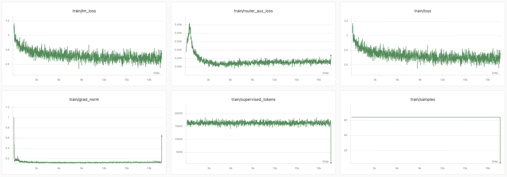
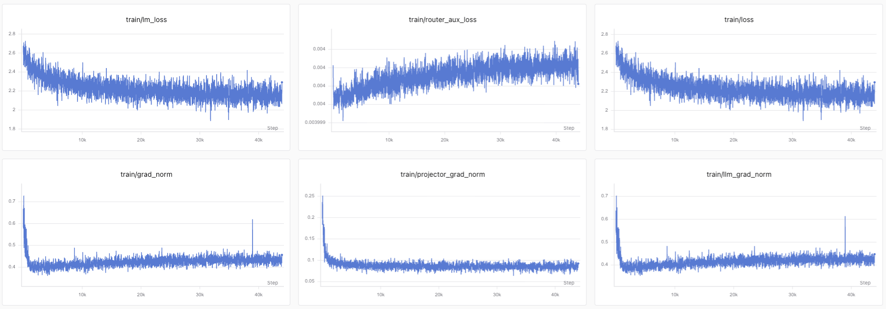

# miniLLM-vlm

### Train a Vision-Language Model on miniLLM Base

[中文](README.md) | English

[Back to the miniLLM project](../README_en.md)

🚀 [**Try the trained miniLLM-vlm online**](https://www.modelscope.cn/studios/kayson2026/miniLLM-vlm)

---

## 🎯 Introduction

miniLLM-vlm is the vision-language extension of [miniLLM](../README_en.md). It reuses a trained miniLLM Base model and a SigLIP vision encoder, aligning image features with language embeddings through a lightweight Projector. This enables the originally text-only miniLLM to understand single images, describe visual content, answer questions about images, and conduct multi-turn image-text conversations.

The project covers the complete workflow from resource preflight checks and data indexing to Visual Pretraining, Visual SFT, checkpoint resume, evaluation, and deployment. The model has been trained and deployed on ModelScope, where images can be uploaded for direct testing.

## ✨ Key Capabilities

- Adds visual understanding to miniLLM Base while preserving its original text-generation path
- Extracts image patch features with SigLIP
- Aligns visual and language spaces through a two-layer MLP Projector
- Supports single-image captioning, visual question answering, and multi-turn image-text conversations
- Supports mixed SFT with image-text samples and text-only instructions
- Reuses reserved tokens for image positions without expanding the tokenizer vocabulary
- Supports resource fingerprints, data indexes, complete checkpoints, and deterministic resume
- Supports SwanLab and Weights & Biases training monitoring
- Supports image-text loss, grouped validation, and mismatched-image comparison

## 🧠 Model Architecture

miniLLM-vlm uses a modular, input-level multimodal fusion design. An image is first encoded by SigLIP. The Projector transforms the resulting visual features, which then directly replace the image-placeholder embeddings in the text sequence before the combined input is passed to miniLLM.

| Component | Configuration and role |
| --- | --- |
| Language model | miniLLM Base, responsible for cross-modal understanding and autoregressive text generation |
| Vision encoder | SigLIP Vision Model, kept frozen during training |
| Image resolution | 256 × 256 |
| Patch size | 32 × 32 |
| Number of visual tokens | 64 |
| Visual feature dimension | 768 |
| Projector | LayerNorm → Linear → GELU → Linear |
| Image placeholder | Reuses a reserved token in the miniLLM tokenizer without changing the vocabulary |
| Fusion method | Replaces the embeddings of contiguous image placeholders with projected visual features |

The goal of this design is not to retrain the vision and language backbones from scratch, but to learn a stable connection between two existing representation spaces. During generation, the image is encoded only once in the prefill stage, while subsequent token generation reuses miniLLM's KV cache.

## 🧩 How an Image Becomes an Answer

For a beginner, miniLLM-vlm can be understood as an image reader, a translator, and a language model working together. An image passes through the following steps before an answer is generated:

1. **Image preprocessing:** The image is converted to 256 × 256 pixels and normalized as required by SigLIP.
2. **Visual feature extraction:** SigLIP divides the image into an 8 × 8 grid of patches and produces one feature vector for each patch, resulting in 64 visual tokens.
3. **Cross-modal translation:** The Projector converts SigLIP's visual features into the language-embedding space used by miniLLM. It acts like a translator that allows two pretrained models to communicate.
4. **Multimodal sequence construction:** The image placeholders in the text are replaced with 64 visual embeddings, which are placed in the same sequence as the user's question and conversation history.
5. **Text generation:** miniLLM reads the visual embeddings and text tokens together, then predicts subsequent tokens one at a time just like an ordinary language model.

| Concept | Intuitive meaning |
| --- | --- |
| Visual token | A numerical representation of a small image region rather than a piece of text |
| Projector | A connector that translates the language of visual features into miniLLM's embedding language |
| Image placeholder | Marks where visual features should be inserted into the text sequence |
| Teacher forcing | Provides the correct answer prefix during training so the model can learn to predict the next token |
| Backpropagation | Traces prediction errors backward to identify which trainable parameters should change |

## 🗺️ Two-Stage Training

The relationship between the stages can be understood with a simple analogy: Visual Pretraining first teaches the Projector to translate images, and Visual SFT then teaches the assistant how to use those images to answer a user's request. Aligning the modalities before learning tasks avoids making large changes to the language model immediately with a relatively small visual dataset.

| Stage | Training data | Default trainable parameters | Objective |
| --- | --- | --- | --- |
| Visual Pretraining | Single-image captions | Projector | Establish basic alignment between image features and language embeddings |
| Visual SFT | Single-image question answering, multi-turn image-text conversations, and text-only instructions | Projector and the first and last miniLLM decoder blocks | Learn visual instruction following and multi-turn conversation |

| Component | Visual Pretraining | Default Visual SFT strategy | Rationale |
| --- | --- | --- | --- |
| SigLIP | Frozen | Frozen | Preserve learned visual representations while reducing memory and compute |
| Projector | Trainable | Trainable | Continue learning the mapping between visual and language spaces |
| miniLLM Base | Frozen | First and last decoder blocks are trainable | Protect language ability during Pretraining, then allow part of the language model to adapt to visual instructions during SFT |
| Tokenizer | Fixed | Fixed | Preserve the correspondence between Base-model weights and token IDs |

Before any parameters are updated, the trainer performs resource preflight checks. It confirms that the Base weights match the tokenizer, SigLIP produces the expected shapes, images can be decoded, conversations are valid, and only the parameters allowed by the current stage receive gradients. The preflight does not update the model; it is designed to expose resource or data problems before a long training run begins.

### 🚀 Visual Pretraining

Visual Pretraining starts from a trained miniLLM Base model and SigLIP. Both backbones remain frozen while only the Projector is updated. Although miniLLM's parameters do not change, answer errors still propagate through the language model back to the Projector, gradually turning the mapped visual features into inputs that miniLLM can understand.

**How one caption sample is trained:**

1. SigLIP converts the image into 64 fixed visual features.
2. The randomly initialized Projector maps them to miniLLM's embedding dimension.
3. The mapped image embeddings are passed to miniLLM together with a prompt such as a request to describe the image.
4. Teacher forcing supplies the reference caption, and the model predicts the next token at every answer position.
5. Differences between the prediction and reference answer form the cross-entropy loss. Gradients pass through the frozen miniLLM and flow back to the Projector.
6. The optimizer updates only the Projector; the SigLIP and miniLLM weights remain unchanged.

**How can a frozen miniLLM still help the Projector learn?** Freezing means that miniLLM's parameters are not updated; it does not disconnect the mathematical computation graph. miniLLM still participates in the forward pass and gradient propagation, so it can tell the Projector what kinds of mapped inputs make the correct caption easier to generate.

The default configuration uses BF16 for one epoch with a maximum sequence length of 512 tokens. The micro-batch size is 8, with 8 accumulation steps for an effective batch size of 64. The training objective combines image-caption cross-entropy with miniLLM's MoE router auxiliary term.

This stage primarily learns what is present in an image rather than complex user intent. In a successful run, validation loss should improve, and the loss for the correct image should be lower than for a mismatched image. This helps show that the model is using visual information instead of guessing from the text prompt alone.

*Language-model loss, router auxiliary loss, total loss, gradient norm, supervised tokens, and sample count during Visual Pretraining.*

### 💬 Visual SFT

Visual SFT inherits the Projector learned during Pretraining and uses images, questions, and ideal answers to learn specific task behavior. The default strategy freezes SigLIP and the middle miniLLM layers while training the Projector and the complete first and last decoder blocks of the language model.

**How one SFT sample is trained:**

1. The data loader reads the image and complete conversation, distinguishing user messages from assistant messages.
2. For an image-text sample, SigLIP and the Projector produce visual embeddings. A text-only sample follows the original language path directly.
3. System messages, user messages, the image, and prior answers form the context used to understand the current task.
4. Only the assistant's answer text and real end token contribute to the supervised loss. Prompts and image positions are not treated as answers to memorize.
5. Gradients update both the Projector and the first and last miniLLM layers, adapting how visual inputs are received and how final answers are organized.

**Why are only the first and last layers unfrozen by default?** The first layer is close to the multimodal input, while the last layer is close to the answer output. Allowing them to adapt while freezing the middle layers is a compromise among task adaptation, language-capability retention, and memory use. It is not the only valid freezing strategy, so the project also retains full fine-tuning and Projector-only options for comparison.

The project also retains two comparison strategies: full language-model fine-tuning and Projector-only training. The default SFT configuration uses BF16 for one epoch with a maximum sequence length of 768 tokens. The micro-batch size is 4, with 16 accumulation steps for the same effective batch size of 64.

This stage no longer learns only generic captions. It learns which evidence to read from an image for the current question and how to format the answer. Evaluation should therefore examine fixed-question generations, image-text and text-only grouped metrics, and whether the original language ability remains intact as visual performance improves, in addition to the loss curve.

*Language-model loss, router auxiliary loss, total loss, overall gradient, Projector gradient, and language-model gradient during Visual SFT.*

## 💾 Data and Supervision

miniLLM-vlm stores images and conversations in Parquet files. The sequence-length budget includes visual tokens, the question, conversation history, and the answer.

| Field | Purpose |
| --- | --- |
| image_bytes | Raw image bytes; not required for text-only samples |
| conversations | Single-turn or multi-turn conversations composed of system, user, and assistant messages |
| task_type | Optional task label distinguishing instruction, caption, and text samples |

Images and questions are readable context. Only the assistant's answer text and the real end token participate in language-model supervision. Image positions, system and user text, and padding are excluded from the answer loss.

The data split is based on image-byte fingerprints and uses a fixed random seed with an approximately 1% validation set by default. Descriptions of the same image in different languages cannot cross the training and validation boundary, reducing inflated results caused by image leakage.

## 📊 Evaluation

The evaluation entry point supports both the Pretraining Adapter and the complete SFT model, including:

- Single-image captioning and visual question answering
- Multi-turn image-text context ending with a user message
- Text-only inference with the SFT model
- Validation cross-entropy weighted by valid answer tokens
- Validation metrics grouped by caption, instruction, image, and text
- Paired loss comparisons between correct and mismatched images
- Periodic generation records for fixed validation questions

The mismatched-image comparison is not a standalone comprehensive visual benchmark, but it helps determine whether the model is truly using image information rather than generating answers from the text prompt alone.

## 🛡️ Reproducibility and Training Safety

- Preflight checks validate the Base model, tokenizer, SigLIP, visual feature shapes, and parameter-freezing state
- The data index records invalid images, malformed conversations, length distributions, and truncation statistics
- Checkpoints preserve the model, optimizer, scheduler, mixed-precision state, random state, and training progress
- Resume strictly verifies the identities of the model, tokenizer, vision encoder, data, code, and critical configuration
- Exported artifacts are kept separate from resumable checkpoints to prevent raw weights or incomplete files from being treated as recoverable state
- Model resources are loaded locally by default and are not automatically downloaded or replaced during training

## 📦 Model Artifacts

| Artifact | Purpose |
| --- | --- |
| Pretraining best_adapter.pt / last_adapter.pt | Projector weights, VLM configuration, and resource identity; the Base model and SigLIP are still required |
| SFT best_sft.pt / last_sft.pt | Fully updated miniLLM weights, Projector, configuration, and resource identity |
| tokenizer directory | Tokenizer files matching the SFT model |
| latest.pt / best.pt | Complete resumable checkpoints containing the optimizer and training progress |
| metrics.jsonl | Local training and validation metrics |
| generations.jsonl | Reference answers and generations for fixed SFT questions |

## 🚀 Online Demo

The trained and deployed miniLLM-vlm is available in a ModelScope Studio. Upload an image and enter a question to explore the model's image-understanding and response capabilities.

### [Open the miniLLM-vlm online demo](https://www.modelscope.cn/studios/kayson2026/miniLLM-vlm)

## 📚 Learning Materials

The repository provides Chinese and English learning paths covering VLM fundamentals, architecture, Visual Pretraining, and Visual SFT practice.

### Chinese

- [Building Vision-Language Models](%E5%AD%A6%E4%B9%A0%E8%B5%84%E6%96%99/%E8%AE%A4%E7%9F%A5%E7%AF%87/VLM%E6%9E%84%E5%BB%BA%E6%96%B9%E6%B3%95.md)
- [VLM Architecture and Training](%E5%AD%A6%E4%B9%A0%E8%B5%84%E6%96%99/%E6%9E%B6%E6%9E%84%E7%AF%87/VLM%E6%9E%B6%E6%9E%84%E4%B8%8E%E8%AE%AD%E7%BB%83%E6%96%B9%E6%B3%95.md)
- [miniLLM-vlm Pretraining](%E5%AD%A6%E4%B9%A0%E8%B5%84%E6%96%99/%E5%AE%9E%E6%88%98%E7%AF%87/miniLLM-vlm%20Pretrain%E8%AE%AD%E7%BB%83.md)
- [miniLLM-vlm SFT](%E5%AD%A6%E4%B9%A0%E8%B5%84%E6%96%99/%E5%AE%9E%E6%88%98%E7%AF%87/miniLLM-vlm%20SFT%E8%AE%AD%E7%BB%83.md)

### English

- [Building Vision-Language Models](learning-materials-en/concepts/Building-Vision-Language-Models.md)
- [VLM Architecture and Training](learning-materials-en/architecture/VLM-Architecture-and-Training.md)
- [miniLLM-vlm Pretraining](learning-materials-en/practice/miniLLM-vlm-Pretraining.md)
- [miniLLM-vlm SFT](learning-materials-en/practice/miniLLM-vlm-SFT.md)

## 🗂️ Project Guide

| Directory or file | Contents |
| --- | --- |
| [model](model/) | miniLLM Base architecture, SigLIP resources, and the VLM Projector |
| [dataset](dataset/) | Pretraining and SFT encoding, indexing, splitting, and collation |
| [trainer](trainer/) | Visual Pretraining, Visual SFT, and shared training utilities |
| [eval](eval/) | Image captioning, visual question answering, text-only inference, and validation evaluation |
| [images](images/) | Pretraining and SFT curves |
| [Chinese Learning Materials](%E5%AD%A6%E4%B9%A0%E8%B5%84%E6%96%99/) | Chinese theory and hands-on articles |
| [English Learning Materials](learning-materials-en/) | English concepts, architecture, and practical guides |
| [requirements.txt](requirements.txt) | Python dependency ranges |

## ⚙️ Scope and Limitations

- The current implementation targets single-machine, single-GPU experiments and was designed around one RTX 4090 on AutoDL
- PyTorch must be matched separately to the active CUDA environment; see [requirements.txt](requirements.txt) for the remaining dependencies
- The current version does not include multi-process DDP, LoRA, quantized training, or compilation optimizations
- The project targets single-image understanding rather than general multi-image, video, or image-generation tasks
- Results depend on data quality, image-text coverage, training resources, and evaluation criteria; the online demo does not represent comprehensive general-purpose visual capability

## 🙏 Acknowledgements

Special thanks to [MiniMind-V](https://github.com/jingyaogong/minimind-v), an important reference for connecting a vision encoder to a lightweight language model, cross-modal alignment, and Visual SFT.

We also thank the contributors to PyTorch, Hugging Face Transformers, Hugging Face Datasets, SigLIP, open datasets, and the broader research community.

---

If miniLLM-vlm helps you, consider leaving a ⭐ and helping improve this small vision-language model.

