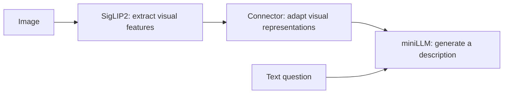

# miniLLM-vlm Pretraining Plan

This project adds image understanding to an existing miniLLM language model. The first stage uses a simple approach: **reuse a pretrained visual encoder and language model, and train only the connector between them so that the language model can use visual information.**

## 1. Core Architecture: See, Connect, Express

The model has three components:



SigLIP2 converts images into visual features, while miniLLM generates text from its inputs. Both have been trained separately, but visual features are not naturally familiar inputs to the language model. A connector provides the adaptation.

The project uses a two-layer MLP connector with the structure `LayerNorm → Linear → GELU → Linear`. It converts visual features into continuous vectors that enter the language model alongside the question text, allowing generation to refer to the image.

The two-layer MLP provides some nonlinear adaptation within a simple structure: linear layers adjust feature combinations, GELU adds expressive capacity, and LayerNorm adjusts feature scale. Even when visual and language hidden dimensions match, separately learned representations may be incompatible, so this mapping still needs to be learned.

This structure makes it straightforward to establish a baseline. More complex query or compression modules introduce additional variables. Comparing their benefits becomes more informative after confirming that the connector is the current bottleneck.

The image enters the language model as continuous visual vectors; it does not first need to become a text description. Retaining several visual positions helps the language model access information from different image regions.

This stage establishes how visual representations can help language generation.

## 2. Why Freeze Both Backbones First?

The visual encoder and language model already possess foundational capabilities. Keeping their weights unchanged and concentrating learning in the connector reduces training cost and makes the experiment easier to interpret: it becomes clearer whether the interface enables the language model to use visual information.

The current connector has approximately 1.18 million trainable parameters. Compared with updating both backbones, this requires fewer optimizer states and avoids changing existing model weights before the connector stabilizes. Unfreezing everything from the beginning would provide more adaptability but increase training cost, data requirements, and debugging difficulty.

**Freezing means that weights do not change; error signals can still pass through the language model to the connector.** The language model both predicts the answer and helps the connector adjust its input representations through backpropagation.

Freezing the language model therefore does not mean skipping its backward computation. Gradients with respect to its inputs are still needed to indicate how visual inputs should change to make the target description easier to predict. This explains why a small trainable parameter count still requires meaningful GPU memory and compute.

This design is useful for first validating image-text alignment. Its ceiling still depends on both backbones: details already lost from the image and reasoning capabilities absent from the language model are difficult to supply through the connector alone.

## 3. How Does the Connector Learn from Captions?

This stage mainly uses images paired with descriptions. For example:

> The image shows a brown puppy running on grass.  
> Input question: “Please describe this image.”  
> Target answer: “A brown puppy is running on green grass.”

Training repeats the following process:

1. The visual encoder extracts image features, and the connector converts them into language model inputs.
2. Conditioned on the image and question, the language model predicts the description's tokens and compares its predictions with the target text.
3. Prediction errors propagate through the language model to the connector, driving changes in the visual representations.

If the current representation does not help predict content such as “puppy,” “brown,” or “grass,” training adjusts it. Across many image-text examples, the connector gradually learns to provide information useful for descriptions.

**Image-text alignment is learned indirectly by predicting image descriptions more accurately.** This project does not supply a target visual vector for each image and ask the connector to fit it directly.

The main text loss is cross-entropy on answer predictions: the lower the probability assigned to the target token, the larger the error. The connector does not know in advance which visual feature should correspond to which word. Across many image-text samples, these error signals teach it to provide useful conditioning.

The image and question are known context, while the main text supervision is placed on the assistant's answer. Image positions are not text prediction targets, but the model must still be able to read them. This focuses learning on generating answers from the image and question.

Training uses preceding reference-answer tokens to help predict subsequent content; actual generation uses the model's own preceding output. Because these conditions differ, falling loss must also be checked against generated results. The implementation retains the Base model's MoE routing auxiliary term, but answer quality and image controls are the main evidence for visual alignment.

## 4. How Is This Plan Organized?

### 4.1 Data Selection: Establish Direct Image-Text Correspondence First

The plan starts with single-image descriptions, which directly link objects, attributes, scenes, and actions to language. Multi-turn conversations, complex instructions, and multi-image comparisons are left to later stages.

The data contains approximately 1.27 million valid samples, retaining the existing Chinese and English descriptions. Sample rows do not equal independent images: one image may have several descriptions. Image-text consistency and content diversity matter alongside scale.

Data preparation first excludes corrupt images and malformed records, and includes spot checks for whether descriptions match images. Incorrect descriptions become incorrect supervision and may teach the model to invent details.

The validation split keeps descriptions with identical image bytes on the same side, reducing leakage. For example, training on an image's Chinese caption and validating on its English caption can make results overly optimistic. The current rule still cannot fully detect near-duplicates created by different compression or cropping.

### 4.2 Key Settings: Control Cost While Retaining Enough Information

| Design choice | Setting | Main consideration |
|---|---|---|
| Image input | 256×256, producing 64 visual positions | Keep computation manageable while testing basic captioning |
| Total image-text length | 512 sequence positions | Cover most captions while limiting long-sequence costs |
| Effective batch | 64 samples, accumulated across smaller batches | Balance single-GPU memory with samples per update |
| Learning rate | Peak 4e-4, gradually decreasing to 4e-5 | Adapt a small randomly initialized connector, with smaller updates later |
| Schedule | Warm up for the first 3% of steps, then cosine decay | Increase the learning rate gradually to reduce overly aggressive early updates |
| Formal training volume | 1 epoch over all valid training data | Establish a complete baseline before deciding what follows |

The 64 visual positions come directly from the encoder's image grid; the connector does not compress them further. Fixed resolution helps control cost, but resizing can erase small text. If the target shifts to dense OCR, reconsider visual input first rather than merely adding epochs.

The 512-position budget includes the image, question, and answer. Approximately 95% of valid samples in this dataset fit completely, making it a reasonable starting point. Long samples retain the complete image and question first, then truncate the answer so that the conditions needed to answer are preserved.

These are initial settings, not proven optima. In particular, the learning rate is chosen for a small connector and needs redesign when the language model is later unfrozen.

### 4.3 Training Pace: Short Trials Check Direction; Full Training Establishes a Baseline

A short trial checks three things first: the connector receives gradients, validation starts improving, and image changes affect answer prediction. Its purpose is to detect problems in the approach or implementation early.

Formal training then uses the full valid training set and its own complete learning-rate schedule to observe whether alignment continues improving. A short trial has its own endpoint and should not be treated as a complete Pretrain result.

One epoch is the initial plan. Validation results should determine whether to continue training, adjust the data, or broaden the trainable scope.

## 5. How Can We Tell Whether the Model Is Using Images?

Falling training error can also reflect learning the language patterns of captions. This plan therefore combines three kinds of evidence:

- **Held-out performance:** compare caption predictions on a fixed validation subset, using up to 2,000 samples per evaluation in this project. Fixed samples make changes easier to track, but this remains validation from the same data source.
- **Correct versus mismatched images:** hold the question and target answer fixed while replacing the image. If the correct image makes the answer easier to predict, that supports the conclusion that the image supplies useful information.
- **Actual generation on new images:** check whether objects, colors, and actions match the image and whether details are fabricated.

In the existing 100-step trial, validation cross-entropy fell from about 3.126 to 2.952, while the loss difference between mismatched and correct images increased from about 0.0005 to 0.0175. Together, these support the conclusion that the connector is beginning to use visual information. They cannot be converted into an improvement in visual question-answering accuracy.

The mismatch design also matters. Replacing an image with a completely different category may test only coarse recognition; images from the same category with different colors or counts test details more directly. Later evaluation should include these controls rather than target a fixed gap threshold.

If training loss falls but validation worsens, consider overfitting or data problems. If validation improves while correct and mismatched images remain nearly indistinguishable, investigate visual usage further. If descriptions are broadly correct but frequently invent details, put more emphasis on factuality evaluation and data quality.

## 6. How Does Pretrain Connect to Later SFT?

This stage produces an image-text-aligned connector. Together with the original visual encoder and language model, it forms a VLM that helps the language model read image information.

Later visual SFT teaches the model to understand user intent. For the same image, a user may request a scene description, a detail, or information in a specified format. That stage requires richer instruction data and evaluation to decide whether some language model parameters should also be trained.

For example, describing “a person standing beside a car” does not mean the model can consistently answer “What color is the car?” or “Output only the number of people.” Training data must distinguish these questions and require selection of the relevant evidence.

If instruction understanding is the bottleneck, investigate language-side adaptation. If image details are already unreadable, improve visual input first. Letting evaluation guide expansion produces more interpretable experience than changing several modules at once.

This project first connects visual information and verifies its effect, then gradually adds tasks and training freedom so that each capability change has an interpretable basis.

## 7. Key Commands

Run these commands in the configured environment. The Base and visual encoder use the project directories `model/miniLLM-base` and `model/siglips`; the data uses the absolute path from the earlier actual run.

```bash
cd /root/miniLLM-vlm
```

### 7.1 Resource Preflight

Check forward and backward passes and frozen states on 8 samples, without updating parameters.

```bash
python trainer/train_pretrain_vlm.py \
  --check-only --device cuda --samples 8
```

### 7.2 A 100-Step Trial

Skip this if a successful trial already exists. The first training run automatically builds a full data index, which later runs reuse when the configuration matches. Limiting training steps does not skip the initial index scan.

```bash
python trainer/train_pretrain_vlm.py \
  --device cuda \
  --max-train-samples 10000 --max-steps 100 \
  --eval-interval 50 --save-interval 50 \
  --save-dir checkpoints/smoke --output-dir out/smoke
```

If an experiment with these directories already exists, choose different save and output directories for a new trial to avoid overwriting earlier results.

### 7.3 One Epoch of Formal Training

Enable SwanLab monitoring. If SwanLab is installed but you have not logged in, first run `swanlab login` once.

```bash
python trainer/train_pretrain_vlm.py \
  --device cuda --dtype bfloat16 \
  --epochs 1 --batch-size 8 --accumulation-steps 8 \
  --learning-rate 4e-4 --min-learning-rate 4e-5 \
  --warmup-ratio 0.03 --max-seq-len 512 \
  --tracker swanlab --tracker-run-name minillm-vlm-pretrain \
  --save-dir checkpoints/pretrain --output-dir out/pretrain
```

Other parameters use the current defaults, including validation and saving every 500 steps. Start formal training as a new experiment, reusing the data index rather than extending the 100-step trial from its checkpoint. To resume an existing formal experiment, retain its directories and parameters.

### 7.4 Resume from a Checkpoint

If you used the formal configuration above, the following command resumes `checkpoints/pretrain/latest.pt`. Parameters not explicitly listed have the same values as in the previous section.

```bash
python trainer/train_pretrain_vlm.py \
  --device cuda \
  --tracker swanlab --tracker-run-name minillm-vlm-pretrain \
  --save-dir checkpoints/pretrain --output-dir out/pretrain \
  --resume
```

Keep the original model, data, and key training parameters unchanged when resuming. If the experiment used modified settings, reuse its original command and add `--resume`.

### 7.5 Validation and Single-Image Generation

Evaluate the best connector on the same validation subset, including correct-versus-mismatched-image comparisons:

```bash
python eval/eval_vlm.py \
  --device cuda \
  --adapter out/pretrain/best_adapter.pt \
  --eval-samples 2000 --output out/pretrain/evaluation.json
```

Then check description quality on a new image. Replace `your_image.jpg` with the actual image path. The question does not need a manually inserted `<image>` marker.

```bash
python eval/eval_vlm.py \
  --device cuda \
  --adapter out/pretrain/best_adapter.pt \
  --image "/root/miniLLM-vlm/eval_images/your_image.jpg" \
  --prompt "Please describe this image in detail." \
  --max-new-tokens 128
```

`best_adapter.pt` is for evaluation and generation; `latest.pt` is for resuming training. The connector artifact must still be used with the original Base, tokenizer, and visual encoder.
