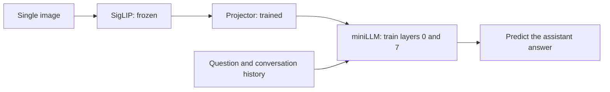

# miniLLM-vlm SFT Training Plan

This article describes the objectives, model adaptation strategy, data processing, settings, and evaluation for visual SFT on a single RTX 4090. SFT inherits the completed Pretrain projector and further teaches the language model to compose answers from images and user questions.

**Recorded on 2026-09-09.** Formal Pretrain training had completed when this article was compiled.

For the preceding stage, see [miniLLM-vlm Pretraining](miniLLM-vlm-Pretraining.md). All training code is maintained independently within `miniLLM-vlm`.

## 1. What Is This SFT Stage Intended to Solve?

Pretrain mainly makes visual features usable inputs to the language model. After alignment, the model still needs to learn how to select information for different questions. The same image may call for a scene description, an answer about the main object's attributes, or an explanation that continues a previous turn.

SFT uses instruction examples with target answers, training the model to predict the assistant's response conditioned on the image, question, and conversation history. The goal is to improve visual question answering, answer organization, and instruction following, while mixed text-only data maintains training coverage for language tasks.

This stage continues using the original Base, its matching tokenizer, and SigLIP. Visual resolution and language model size still constrain capabilities. Small text lost during resizing, for example, cannot be recovered merely by adding SFT steps.

### 1.1 Why Continue from the Current Pretrain Result?

Formal Pretrain produced these results on fixed validation samples:

| Metric | Initial | Best, also the final validation |
|---|---:|---:|
| Optimizer update steps | 0 | 19681 |
| Validation language loss | 3.126354 | 2.681597 |
| Mismatched-image loss minus correct-image loss | 0.000530 | 0.306967 |
| Image comparison samples | 2000 | 2000 |

Validation loss decreased by approximately 14.23%, and the image comparison gap widened substantially. This supports the conclusion that the projector has learned to provide useful visual conditioning. These results cannot be converted into visual question-answering accuracy and do not replace description checks on new images, but they support proceeding to SFT preflight and a short trial.

## 2. Adapt the First and Last Language Layers

This project initializes from formal Pretrain weights, continues training the projector, and unfreezes the first and last language layers so that visual representations and answer generation can adapt together to instruction data. It uses a learning rate of `5e-6` and a sequence length of 768, with 1 epoch as the initial formal baseline. The implementation also offers projector-only training and unfreezing the entire language model, allowing later comparisons of cost and performance across update scopes.

### 2.1 Model Components and Trainable Scope



The projector retains the structure `LayerNorm → Linear → GELU → Linear`. SigLIP produces 64 visual vectors, which are projected and replace reserved image positions in the text sequence. Text-only samples go directly to the language model, bypassing the visual encoder.

| Component | Current state | Role |
|---|---|---|
| SigLIP | Frozen, kept in eval mode | Extract existing visual features |
| Projector | Continue training | Adjust the mapping from visual representations to language inputs |
| LLM layer 0 | Trained | Adapt image-text representations entering the language network |
| LLM layers 1–6 | Frozen | Preserve existing intermediate language representation weights |
| LLM layer 7 | Trained | Adapt task representations near the output |
| Embedding, final normalization, output head | Frozen | Preserve their existing parameters |

Layers 0 and 7 are the first and last complete decoder blocks, using zero-based numbering. They include attention, normalization, MoE routers, and expert parameters. This choice is a starting point for controlling training scale, not a proven optimal adaptation scope for this model.

**Freezing parameters does not mean cutting off backpropagation.** The frozen intermediate layers must still propagate gradients to the first layer and projector. The entire language model must not be placed inside `no_grad()`. Only visual feature extraction uses `no_grad()` in this implementation.

The `--freeze-llm` parameter means:

| Value | Trainable scope | Usage |
|---|---|---|
| `1` | Projector + First and last language layers | Default for this plan |
| `0` | Projector + Entire language model | Available for later comparison; remeasure memory and performance |
| `2` | Projector only | Requires exclusively image-text data in this project; an SFT index containing text-only samples is rejected |

The model has **295,526,400** parameters, of which **49,557,504** are trainable. Pretrain updates only the projector's 1,182,720 parameters. SFT broadens the update scope so visual representations and language layers can adapt together to instruction tasks.

### 2.2 Initialization and Resuming Are Different Operations

The first SFT run uses `--from-pretrain`: load the original Base and SigLIP, then load the formal Pretrain projector and create a new optimizer, learning-rate schedule, and SwanLab experiment.

Cross-stage loading checks the identities of the Base, visual resources, and tokenizer; the VLM configuration; and projector parameter names, shapes, and finite values. It also records the source file hash and Pretrain step. Different implementation versions between Pretrain and SFT are allowed, but resource matching checks are not skipped.

`--resume` restores an existing SFT checkpoint, including the updated LLM, projector, optimizer, and training position. Do not confuse these operations: formal SFT does not continue from the smoke run's optimizer state, and resuming SFT requires more than loading a projector file.

## 3. Training Environment and Resource Organization

### 3.1 Verified Server Environment

| Item | Configuration |
|---|---|
| GPU | One NVIDIA GeForce RTX 4090 |
| CPU | 25 cores |
| RAM | 90 GB |
| PyTorch | `2.3.0+cu121`, CUDA available |
| Compute precision | BF16 autocast, with FP32 master model parameters |
| Base | miniLLM, hidden size 768, 8 layers, vocabulary 8192, 4 MoE experts |
| Visual encoder | `model/siglips`, loaded with `SiglipVisionModel` |
| Image input | 256×256, patch size 32, 64 visual positions |

This configuration has passed the project's GPU preflight and short training trial.

### 3.2 Resource Directories

This article uses example paths: `/root/miniLLM-vlm` is the code directory, and `/data/miniLLM-vlm` holds data and training artifacts. Replace them consistently with the actual locations on your server before running the commands.

```text
/root/miniLLM-vlm/                         # Code directory
├── model/miniLLM-base/                    # Original Base and matching tokenizer
├── model/siglips/                         # Frozen visual resources
└── out/pretrain_swanlab/best_adapter.pt    # Initialization source for this SFT run

/data/miniLLM-vlm/                        # Data and training artifacts
├── dataset/sft_i2t.parquet                # Downloaded raw SFT data
├── cache/arrow/                          # Hugging Face Arrow cache
├── cache/sft_smoke_index.json             # Sampled index for the short trial
├── cache/sft_index.json                   # Index from the full scan
├── checkpoints/sft/                      # Formal training recovery checkpoints
└── out/sft/                              # Inference weights, tokenizer, and logs
```

Relative paths in the code are resolved from the VLM project root. The short trial and formal training use separate indexes, checkpoints, and output directories to record their results independently.

## 4. Data Plan: Single Images, Multiple Turns, and Text-Only Samples

The `sft_i2t.parquet` file read for this run contains **2,904,511 rows**. This is the raw row count, not the final number of valid training samples or independent images. Formal training still filters invalid rows and holds out a validation set.

### 4.1 Conversation and Image Formats

The Parquet data requires `conversations` and `image_bytes` columns. Conversations can be JSON strings or structured lists. Both `role/content` and `from/value` formats are supported, including the `human/gpt` role names. A conversation consists of an optional system message followed by complete user/assistant pairs.

Example of a multi-turn conversation about one image:

```json
[
  {"role": "user", "content": "<image>\nPlease describe this image."},
  {"role": "assistant", "content": "A brown puppy is standing on the grass."},
  {"role": "user", "content": "What color is the puppy?"},
  {"role": "assistant", "content": "Brown."}
]
```

The single `<image>` marker belongs in the first user message. `image_bytes` contains the corresponding image bytes or a single-element list of bytes. This version does not support multiple images or tool-call conversations.

Text-only samples contain no `<image>` marker. Their image column can be empty or contain unused placeholder data. When `task_type=text` is explicitly specified, the implementation removes image markers from user messages and skips the image. It does not infer a text-only sample merely because the image is black, avoiding incorrect treatment of real black images.

Optional `task_type=instruction` and `caption` values support grouped statistics. Without this metadata, image-text samples are grouped as `image`. An instruction/caption count of 0 in the logs therefore does not mean those tasks are absent from the data.

This run directly uses the downloaded mixed SFT file without additionally concatenating the Pretrain file. The short trial's validation set contained 182 image-text and 18 text-only samples, showing that both types entered validation. This is not the precise mixture of the full dataset.

### 4.2 Supervise Only Assistant Answers

Sequences use the Base model's ChatML control tokens. The existing `<|reserved_0|>` token, with token ID 9, represents image positions; the vocabulary is not expanded.

| Sequence content | Included in text loss? |
|---|---|
| System, user, and role headers | No; label is `-100` |
| 64 image positions | No, but attention mask is 1 |
| Each assistant message body and its actual EOS | Yes |
| Padding | No; attention mask is 0 |

The maximum 768 positions include the image, conversation history, questions, and answers. Truncation preserves the conversation prefix and the first image. If a later question does not fit, that turn and subsequent turns are discarded. An answer can be truncated at the budget boundary without adding a fabricated EOS. Rows with no room for any supervised answer after the first question are filtered out. This version does not expand long conversations into sliding-window samples.

### 4.3 Image Splits Follow the Pretrain Rule

The raw image bytes' SHA-256, `seed=42`, and `val_ratio=0.01` determine whether an image belongs to training or validation. Chinese, English, and multi-turn samples sharing identical image bytes stay on the same side. SFT uses the same rule to prevent the same image from entering opposite sets across Pretrain and SFT.

This guarantee does not cover near-duplicates with different compression, crops, or re-encoding. Text-only samples are split by the hash of serialized structured conversation content, not by a shared placeholder black image. If Pretrain used a different seed or validation ratio, SFT must be adjusted accordingly.

## 5. Optimizer, Learning Rate, and Training Pace

| Parameter | Formal training setting |
|---|---|
| Epochs | 1 |
| Batch per forward pass | 4 |
| Gradient accumulation | 16 |
| Single-GPU effective batch | `4 × 16 = 64` |
| Learning rate | `5e-6`, with minimum `5e-7` |
| Schedule | Warmup for the first 3% of update steps, then cosine decay |
| Optimizer | AdamW |
| Weight decay | 0.01; no decay on bias or normalization parameters |
| Gradient clipping | Global norm limit of 1.0 over all trainable parameters |
| Data loader workers | 4 |
| Validation samples | Fixed subset of up to 2000 |
| Logging interval | Every 10 optimizer update steps |
| Validation and save interval | Every 500 update steps, and at the end of the stage |

The loss combines assistant cross-entropy with the Base model's existing router auxiliary term. Cross-entropy is weighted by the number of valid supervised tokens within each accumulated update, and the router auxiliary term is added only once. Logs report the terms separately so improvements in language prediction are not confused with changes in the auxiliary term.

The SFT learning rate is smaller than the Pretrain rate because pretrained language layers are now being adjusted. Keep the batch and learning rate fixed for the initial baseline. Changing update scope, learning rate, and data mixture together would make results harder to compare.

## 6. Training Procedure

### 6.1 Confirm the Resources

```bash
cd /root/miniLLM-vlm

ls -lh /root/miniLLM-vlm/out/pretrain_swanlab/best_adapter.pt
ls -lh /data/miniLLM-vlm/dataset/sft_i2t.parquet
```

Prepare the Base, SigLIP, matching tokenizer, formal Pretrain artifact, and SFT data before training. To enable SwanLab, complete `swanlab login` in the server terminal.

### 6.2 SFT Preflight

```bash
python trainer/train_sft_vlm.py \
  --check-only \
  --device cuda \
  --samples 8 \
  --from-pretrain /root/miniLLM-vlm/out/pretrain_swanlab/best_adapter.pt \
  --data-path /data/miniLLM-vlm/dataset/sft_i2t.parquet \
  --cache-dir /data/miniLLM-vlm/cache \
  --report-path /data/miniLLM-vlm/out/sft_preflight.json
```

Preflight performs actual forward and backward passes to verify resource identities, frozen states, and gradients. It does not create an optimizer, tracker, or training checkpoint.

Actual output from this run:

| Item | Result |
|---|---|
| Initialization source step | 19681 |
| Freeze check | passed |
| Input shape | `[8, 503]` |
| Checked samples | 8 image-text, 0 text-only |
| Language loss | 2.681476 |
| Projector gradient norm | 0.431863 |
| LLM gradient norm | 1.185572 |
| Peak allocated CUDA memory | Approximately 3.47 GiB |

`data_stats: null` means a complete index scan was not performed. `text_samples: 0` only means the first 8 samples contained no text-only examples; it says nothing about their presence in the full dataset. Preflight memory also excludes optimizer states created later during full training.

### 6.3 A 100-Step Trial

```bash
python trainer/train_sft_vlm.py \
  --device cuda \
  --dtype bfloat16 \
  --from-pretrain /root/miniLLM-vlm/out/pretrain_swanlab/best_adapter.pt \
  --data-path /data/miniLLM-vlm/dataset/sft_i2t.parquet \
  --cache-dir /data/miniLLM-vlm/cache \
  --index-path /data/miniLLM-vlm/cache/sft_smoke_index.json \
  --freeze-llm 1 \
  --batch-size 4 \
  --accumulation-steps 16 \
  --max-seq-len 768 \
  --scan-samples 20000 \
  --max-train-samples 10000 \
  --max-steps 100 \
  --eval-samples 200 \
  --log-interval 10 \
  --eval-interval 50 \
  --save-interval 50 \
  --tracker swanlab \
  --tracker-project miniLLM-VLM-SFT \
  --tracker-run-name sft-smoke-4090 \
  --save-dir /data/miniLLM-vlm/checkpoints/sft_smoke \
  --output-dir /data/miniLLM-vlm/out/sft_smoke
```

`--scan-samples 20000` selects a fixed random subset of 20,000 rows for index checks. `--max-train-samples 10000` then limits the valid training set. `--max-steps 100` limits optimizer updates. They serve different purposes.

With an effective batch of 64, 100 complete updates process approximately 6400 samples, rather than one pass over all 10,000. After the trial, wait for `Completed at step 100`, verify that saving succeeded and the command prompt returned, then start the formal experiment.

### 6.4 Formal Training

```bash
cd /root/miniLLM-vlm

python trainer/train_sft_vlm.py \
  --device cuda \
  --dtype bfloat16 \
  --from-pretrain /root/miniLLM-vlm/out/pretrain_swanlab/best_adapter.pt \
  --data-path /data/miniLLM-vlm/dataset/sft_i2t.parquet \
  --cache-dir /data/miniLLM-vlm/cache \
  --index-path /data/miniLLM-vlm/cache/sft_index.json \
  --freeze-llm 1 \
  --epochs 1 \
  --max-seq-len 768 \
  --batch-size 4 \
  --accumulation-steps 16 \
  --learning-rate 5e-6 \
  --min-learning-rate 5e-7 \
  --warmup-ratio 0.03 \
  --num-workers 4 \
  --eval-samples 2000 \
  --log-interval 10 \
  --eval-interval 500 \
  --save-interval 500 \
  --tracker swanlab \
  --tracker-project miniLLM-VLM-SFT \
  --tracker-run-name sft-4090 \
  --save-dir /data/miniLLM-vlm/checkpoints/sft \
  --output-dir /data/miniLLM-vlm/out/sft
```

Formal training removes the trial's scan sampling, training-sample cap, and 100-step endpoint. It uses separate index and output directories and initializes a new SFT schedule from the same formal Pretrain artifact. The actual update count depends on the filtered training sample count; the raw 2.9 million rows cannot determine an exact step count.

## 7. Data Preprocessing and Indexing

Before training, the data is loaded and a valid-sample index is built. Preprocessing checks image decoding, complete conversation roles and turns, correct image-marker placement, and valid answer supervision within the sequence budget. Invalid samples are filtered, with reasons recorded for data-quality inspection.

The index stores valid row numbers, training/validation assignments, and statistics. Images still come from the original data and Arrow dataset. Fixed data identity, tokenizer, length, seed, and split ratio keep experimental inputs consistent. Configuration changes require a corresponding new index.

The trial index checks only a fixed sample of 20,000 rows to verify the training pipeline; the formal index checks all data for full training. Limiting optimizer updates and limiting indexed samples are independent settings. The current implementation loads the full data before sampling rows for indexing.

Once the model and data are ready, initial validation is recorded before parameter updates. This allows comparison before and after SFT under the same validation settings.

## 8. Trial Results and SwanLab Monitoring

### 8.1 Actual Metrics from the 100-Step Run

Validation uses a fixed set of 200 samples: 182 image-text and 18 text-only.

| Metric | Step 0 | Step 50 | Step 100 |
|---|---:|---:|---:|
| Overall validation loss | 2.582140 | 2.543748 | 2.531904 |
| Image-text validation loss | 2.700938 | 2.660738 | 2.650132 |
| Text-only validation loss | 1.888533 | 1.860694 | 1.841619 |
| Mismatched-image loss minus correct-image loss | 0.210671 | 0.193204 | 0.189858 |

Overall validation loss decreased by approximately 1.95%, with improvements on both image-text and text-only samples. Recorded update throughput was about 42–44 samples/second, peak allocated CUDA memory was approximately 3.82 GiB, and both projector and LLM gradients were nonzero and finite. This memory metric is not total process memory reported by `nvidia-smi`. Throughput excludes the full scan and all validation and saving time, so it does not guarantee total training duration.

The image comparison gap remains positive but is smaller than initially. As language layers adapt, losses with both correct and incorrect images may decrease. Gap changes alone cannot establish visual improvement or regression; interpret them alongside image-text loss and actual generation. The 18 text-only validation samples are also insufficient to demonstrate preservation of overall language capabilities.

### 8.2 Which Curves Should You Watch?

The SwanLab project is `miniLLM-VLM-SFT`. It is initialized after indexing, so the absence of training curves during the scan is normal.

| Metric | Purpose |
|---|---|
| `train/lm_loss`, `val/lm_loss` | Language prediction error; training values fluctuate across batches |
| `val/visual_lm_loss` | Performance on the image-text subset |
| `val/text_lm_loss` | Performance on the text-only subset, interpreted with its sample count |
| `paired/wrong_minus_correct` | Whether correct images help compared with mismatched images |
| `train/projector_grad_norm`, `train/llm_grad_norm` | Whether both components receive useful gradients |
| `router/expert_*_fraction` | Whether expert usage becomes unusually concentrated |
| `train/learning_rate` | Check the current schedule stage |
| `train/samples_per_second`, `train/peak_memory_gib` | Monitor compute efficiency and GPU memory |

Image comparisons permute only image-text samples and exclude identical preprocessed images. The best model is selected by `val/selection_loss`: use the explicit instruction group if present; otherwise use all image-text loss, falling back to overall loss only when there are no image-text samples. This trial has no explicit instruction/caption metadata, so selection uses image-text loss.

Each validation also generates answers for fixed samples: by default, 4 samples with at most 64 new tokens, appended to `out/sft/generations.jsonl`. These texts are stored locally and are not uploaded to SwanLab by the current implementation. Inspect subjects, attributes, hallucinations, repetition, and whether the answer addresses the question.

## 9. Recovery and Artifact Usage

### 9.1 Keep the Training Trajectory Consistent

Training checkpoints save the model, optimizer, learning-rate schedule, random states, and next batch position. To resume, reuse the complete formal training command and append `--resume`. By default, it reads `save-dir/latest.pt`.

The resume contract checks code, resources, data, trainable scope, batch, and learning-rate schedule to avoid mixing different experiments. Changes to epochs, learning rate, or the maximum training steps should be recorded as a new experiment. `--stop-after-steps` can test pausing and recovery without changing the original schedule endpoint.

### 9.2 Training Checkpoints Versus Inference Files

| Artifact | Main purpose |
|---|---|
| `checkpoints/sft/latest.pt`, `best.pt` | Resume training; include the complete model, optimizer, scheduler, Scaler, RNG, progress, and tracker ID |
| `out/sft/best_sft.pt`, `last_sft.pt` | Inference; include the complete updated LLM, projector, configuration, and resource identities |
| `out/sft/tokenizer/` | Exported matching tokenizer; original Base files remain unchanged |
| `out/sft/run_config.json` | Parameters, trainable parameter list, index statistics, and resume contract |
| `out/sft/metrics.jsonl` | Local numerical logs |
| `out/sft/generations.jsonl` | Fixed questions, reference answers, and generated answers |

Because SFT updates language layers, final inference cannot use only the projector with the original Base. Retain at least `best_sft.pt`, the matching `tokenizer/`, and matching SigLIP resources. The SFT inference loader restores the complete LLM directly from the artifact and does not need the original Base weights. Resuming training still requires retaining the original initialization resources under the current implementation.

## 10. Evaluation After Formal Training

First confirm that the terminal reports Completed and the actual final step, and that `best_sft.pt` and `last_sft.pt` were saved successfully. The final validation log alone does not establish that saving has finished.

### 10.1 Evaluate on the Fixed Validation Set

```bash
cd /root/miniLLM-vlm

python eval/eval_vlm.py \
  --device cuda \
  --dtype bfloat16 \
  --sft-model /data/miniLLM-vlm/out/sft/best_sft.pt \
  --vision-model /root/miniLLM-vlm/model/siglips \
  --data-path /data/miniLLM-vlm/dataset/sft_i2t.parquet \
  --cache-dir /data/miniLLM-vlm/cache \
  --index-path /data/miniLLM-vlm/cache/sft_index.json \
  --max-seq-len 768 \
  --seed 42 \
  --val-ratio 0.01 \
  --batch-size 4 \
  --eval-samples 2000 \
  --output /data/miniLLM-vlm/out/sft/evaluation_best.json
```

Keep the same data, split, length, and evaluation batch as during training. Batch size affects mismatched-image pairing, so a gap measured after changing it is not an identical control. To compare the best and final models, replace the model path with `last_sft.pt` and choose a different output file.

Pretrain and SFT use different data, lengths, sample sets, and supervision. Their absolute loss values cannot be directly compared as a measure of capability. Compare step 0 and post-training results under the same SFT validation configuration instead.

### 10.2 Image Question Answering and Text-Only Generation

Replace the image path with a real uploaded file:

```bash
python eval/eval_vlm.py \
  --device cuda \
  --sft-model /data/miniLLM-vlm/out/sft/best_sft.pt \
  --vision-model /root/miniLLM-vlm/model/siglips \
  --image /data/miniLLM-vlm/images/example.jpg \
  --prompt 'What is in the image? Describe only what you can see.' \
  --max-new-tokens 128

python eval/eval_vlm.py \
  --device cuda \
  --sft-model /data/miniLLM-vlm/out/sft/best_sft.pt \
  --vision-model /root/miniLLM-vlm/model/siglips \
  --text \
  --prompt 'Explain how to organize study notes in three sentences.' \
  --max-new-tokens 128
```

For multi-turn inference, `--messages` reads a JSON message list ending with a user message and can be used with `--image` or `--text`. In image mode, the entry point inserts `<image>` into the first user message if it is missing.

Spot-check images not used in training, covering different scenes and questions in both Chinese and English. Record object, attribute, and count accuracy, instruction following, hallucinations, and repetition. Also test a separate set of text-only questions. Four fixed generation samples help track changes but do not represent the model's full capabilities.

## 11. Implementation and Validation Scope

| File | Responsibility |
|---|---|
| [train_sft_vlm.py](../../trainer/train_sft_vlm.py) | SFT entry point, preflight, training loop, saving, and fixed-sample generation |
| [model_vlm.py](../../model/model_vlm.py) | Model composition, first/last-layer training strategy, and image-text/text-only forward passes |
| [vlm_dataset.py](../../dataset/vlm_dataset.py) | Multi-turn labels, mixed batches, splits, and resumable indexes |
| [trainer_utils.py](../../trainer/trainer_utils.py) | Resource checks, cross-stage initialization, SwanLab, evaluation, and export |
| [train_pretrain_vlm.py](../../trainer/train_pretrain_vlm.py) | Shared argument parsing and token-weighted update functions |
| [eval_vlm.py](../../eval/eval_vlm.py) | Evaluation and inference for Pretrain and SFT artifacts |
| [test_sft_vlm.py](../../tests/test_sft_vlm.py) | Offline SFT regression tests |

The complete local suite passed 15 tests, covering existing Pretrain regressions and SFT labels, frozen layers, gradient accumulation, index recovery, training recovery, and export. The isolation test copies only the VLM's own code and runs without the parent project. Synthetic CPU tests verified element-wise identical LLM/projector parameters between uninterrupted training and pause/resume training with nonzero dropout.

The training server additionally passed GPU preflight and a 100-step training/validation run using the real Base, SigLIP, and data. The quality of formal full-data training still needs evaluation after completion as described above; successful preflight or falling trial loss cannot substitute for it.
