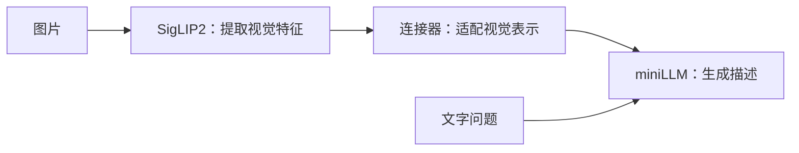

# miniLLM-vlm Pretrain方案思路

本次项目希望在已有 miniLLM 语言模型上增加图片理解能力。第一阶段采用一个简单方案：**复用已经训练好的视觉编码器和语言模型，只训练中间的连接器，让视觉信息能够被语言模型利用。**

## 1. 核心架构：看图、连接、表达

整个模型由三个部分组成：



SigLIP2 将图片转换成视觉特征，miniLLM 负责根据输入生成文字。两者分别接受过训练，但视觉特征并不天然就是语言模型熟悉的输入，因此需要一个连接器完成适配。

本项目使用两层 MLP 作为连接器，具体结构为 `LayerNorm → Linear → GELU → Linear`。它把视觉特征转换为一组连续向量，与问题文本一起送入语言模型，让后续生成能够参考图片内容。

选择两层 MLP，是为了在简单结构中提供一定的非线性适配能力：线性层调整特征的组合方式，GELU 增加表达能力，LayerNorm 调整特征尺度。即使视觉与语言的隐藏维度相同，两者分别训练得到的表示也未必兼容，仍需要学习这种映射。

这套结构便于先建立基线。更复杂的查询或压缩模块会引入新的变量，只有确认当前瓶颈来自连接器之后，再比较它们的收益才更有针对性。

图像进入语言模型时，仍然是一组连续视觉向量，不需要先转成一段文字描述。保留多个视觉位置，有助于语言模型访问图片中不同区域的信息。

这一阶段要建立的，是“视觉表示如何帮助语言生成”的关系。

## 2. 为什么先冻结两个主干

视觉编码器和语言模型已经具备各自的基础能力。先保持它们的权重不变，把学习集中在连接器上，可以降低训练成本，也让实验更容易分析：我们能更清楚地判断，这个接口是否让语言模型用上了视觉信息。

当前连接器约有 118 万个可训练参数。与同时更新两个主干相比，它需要的优化器状态更少，也避免在连接器尚未稳定时直接改变已有模型权重。如果一开始就全面解冻，虽然适应能力更强，但训练成本、数据要求和问题定位难度也会增加。

**冻结表示权重不更新，误差信号仍然可以经过语言模型传回连接器。** 语言模型在这里既负责预测答案，也通过反向传播帮助连接器调整输入表示。

因此，冻结语言模型并不意味着跳过它的反向计算。它仍需保留对输入的梯度，用来回答“视觉输入怎样变化，目标描述才更容易被预测”。这也是可训练参数很少、实际训练仍需要一定显存与计算的原因。

这种设计适合先验证图文对齐的可行性。它的能力上限仍受两个主干影响：图片中已经丢失的细节、语言模型尚不具备的推理能力，都很难只靠连接器补足。

## 3. 连接器怎样从描述中学习

本阶段使用“图片 + 描述文字”作为主要训练数据。例如：

> 图片中，一只棕色小狗正在草地上奔跑。  
> 输入问题：“请描述这张图片。”  
> 目标答案：“一只棕色小狗正在绿色草地上奔跑。”

训练围绕以下过程反复进行：

1. 视觉编码器提取图片特征，连接器把它转换为语言模型的输入。
2. 语言模型在图片和问题的条件下预测描述中的词，并与目标文字比较。
3. 预测误差经过语言模型传回连接器，推动连接器调整视觉表示。

如果当前表示不能帮助预测“小狗”“棕色”“草地”等内容，训练就会调整它。随着图文样本增多，连接器逐渐学会提供对描述有用的信息。

**图文对齐通过“更准确地预测图片描述”间接实现。** 本项目没有为每张图准备一份标准视觉向量，让连接器直接照着拟合。

主要的文字损失是答案预测的交叉熵：目标词被赋予的概率越低，误差越大。连接器并不知道某种视觉特征应该对应哪个词，而是在大量图文样本中，通过这种误差信号逐渐学会提供有效条件。

图片与问题是已知条件，主要的文字监督放在助手答案上。图像位置虽然不作为文字预测目标，仍然必须能被模型读取。这样，学习目标就集中在根据图片与问题生成答案。

训练时使用前面真实的答案词帮助预测后续内容；实际生成时使用的是模型自己的前文。两种条件不同，所以损失下降还需要通过生成效果来验证。当前实现也保留 Base 原有的 MoE 路由辅助项，但判断视觉对齐效果，主要看答案质量和图像对照。

## 4. 本次方案怎样安排

### 4.1 数据选择：先建立直接的图文对应

方案先解决单图描述，因为它能直接提供对象、属性、场景和动作之间的图文对应关系。多轮对话、复杂指令和多图比较留给后续阶段。

本次数据约有 127 万条有效样本，保留已有的中英文描述。样本行数不等于独立图片数量，同一图片可能对应多条描述，因此除了规模，还要关注图文一致性和内容多样性。

数据方案先排除损坏图片和格式异常，并安排抽样检查描述是否符合图片。错误描述会直接变成错误监督，模型也可能因此学会虚构细节。

验证划分让相同图片字节对应的描述留在同一侧，减少训练与验证之间的泄漏。例如，同一图片的中文描述用于训练、英文描述用于验证，就可能使验证结果偏乐观。当前规则仍不能完全识别不同压缩或裁剪版本的近重复图片。

### 4.2 关键设置：控制成本，同时保留足够信息

| 设计项 | 本次选择 | 主要考虑 |
|---|---|---|
| 图片输入 | 256×256，产生 64 个视觉位置 | 保持计算规模可控，先验证基本图片描述能力 |
| 图文总长度 | 512 个序列位置 | 覆盖多数描述，限制长序列开销 |
| 有效 Batch | 64 个样本，分批计算后累积更新 | 兼顾单卡内存与每次更新的样本量 |
| 学习率 | 峰值 4e-4，逐渐降低到 4e-5 | 适配随机初始化的小连接器，后期减小更新幅度 |
| 调度 | 前 3% 步数预热，随后余弦衰减 | 起步逐渐增加学习率，减少早期更新过猛的风险 |
| 正式训练量 | 全量有效训练集 1 轮 | 建立完整基线，再根据验证结果决定下一步 |

64 个视觉位置直接来自视觉编码器的图片网格，连接器不再额外压缩它们。固定分辨率适合控制成本，但小字可能在缩放时丢失；如果目标转向密集 OCR，首先应重新考虑视觉输入，而不是只增加训练轮数。

512 的长度预算同时包括图像、问题和答案。本次约 95% 的有效样本可以完整容纳，因此它是一个合理起点。超长样本优先保留完整图像和问题，再截断答案，避免模型失去回答所需的条件。

这些设置属于起始方案，并非已经证明最优。尤其是当前学习率针对小连接器选择，后续解冻语言模型时需要重新设计。

### 4.3 训练节奏：短实验验证方向，全量训练建立基线

短实验先确认三件事：连接器能获得梯度、验证表现开始改善、图片变化能够影响答案预测。它的价值是尽早发现方向或实现问题。

正式阶段再使用全量有效训练集合和对应的完整学习率调度，观察对齐效果能否持续改善。短实验有自己的训练终点，不能把其结果直接视为完整 Pretrain 的结论。

一轮是本次的起始安排。是否继续训练、调整数据或扩大可训练范围，要由验证表现决定。

## 5. 怎样判断模型确实在看图

训练误差下降，可能同时来自描述语言规律的学习。因此，本方案结合三类证据：

- **保留样本上的表现**：在固定的验证子集上比较描述预测，本项目每次使用最多 2,000 条。固定样本便于观察变化，但这仍是同一数据来源下的验证。
- **正确图与错配图的对照**：保持问题和目标答案不变，只替换图片；如果正确图使答案更容易被预测，就支持图像提供了有用信息的判断。
- **新图片的实际生成**：检查对象、颜色、动作等是否符合图片，以及是否出现虚构细节。

已有 100 步短实验中，验证交叉熵从约 3.126 降到 2.952，错配图与正确图的损失差从约 0.0005 增至 0.0175。两项变化共同支持连接器开始利用视觉信息的判断，但不能换算成视觉问答准确率的提升。

错配方式也影响结论：随机换成完全不同类别的图片，可能只检验粗粒度识别；同类但颜色、数量不同的图片，更能检验细节。后续应结合这样的对照，而不是追求一个固定的差值阈值。

如果训练损失下降、验证却变差，要考虑过拟合或数据问题；如果验证改善但正确图与错配图区别很小，应继续检查视觉利用；如果描述整体正确但经常编造细节，就需要更重视事实性评估和数据质量。

## 6. Pretrain 与后续 SFT 怎样衔接

本阶段获得的是一个经过图文对齐的连接器。它与原有视觉编码器、语言模型共同组成 VLM，帮助语言模型读取图片信息。

后续视觉 SFT 则进一步训练模型理解用户意图：同一张图片，用户可能要求描述场景、回答细节，或按指定格式提取信息。届时需要更丰富的指令数据，并根据效果决定是否训练语言模型的部分参数。

例如，模型能描述“一个人站在汽车旁边”，不代表它已经能够稳定回答“汽车是什么颜色”或“只输出人数”。这些能力需要让训练数据体现问题之间的差异，并要求模型选择相应证据。

如果瓶颈在指令理解，可以研究语言侧适配；如果图片细节已经看不清，应优先改进视觉输入。让评估结果决定扩展方向，比同时更换多个模块更容易积累可靠经验。

本次先把视觉信息接入并验证其作用，再逐步增加任务和训练自由度，让每一步的能力变化都有可以解释的依据。

## 7. 关键操作命令

以下命令对应本文方案，在已配置好的环境执行。Base 和视觉编码器使用项目内的 `model/miniLLM-base`、`model/siglips`，数据使用此前实际运行的绝对路径。

```bash
cd /root/miniLLM-vlm
```

### 7.1 资源预检

检查 8 条样本的前向、反向和冻结状态，不更新参数。

```bash
python trainer/train_pretrain_vlm.py \
  --check-only --device cuda --samples 8 \
```

### 7.2 100 步短实验

已有成功短实验时可以跳过。首次训练会自动建立全量数据索引，之后配置一致时复用；限制训练步数不会省略首次索引扫描。

```bash
python trainer/train_pretrain_vlm.py \
  --device cuda \
  --max-train-samples 10000 --max-steps 100 \
  --eval-interval 50 --save-interval 50 \
  --save-dir checkpoints/smoke --output-dir out/smoke
```

已有同名实验时，重新试验需更换保存和输出目录，避免覆盖旧结果。

### 7.3 正式训练一轮

启用 SwanLab 监控；已安装 SwanLab 但尚未登录时，先执行一次 `swanlab login`。

```bash
python trainer/train_pretrain_vlm.py \
  --device cuda --dtype bfloat16 \
  --epochs 1 --batch-size 8 --accumulation-steps 8 \
  --learning-rate 4e-4 --min-learning-rate 4e-5 \
  --warmup-ratio 0.03 --max-seq-len 512 \
  --tracker swanlab --tracker-run-name minillm-vlm-pretrain \
  --save-dir checkpoints/pretrain --output-dir out/pretrain
```

其余参数采用当前默认值，包括每 500 步验证和保存。正式训练作为新实验开始，复用数据索引，不从 100 步短实验的断点延长训练。已有正式实验时，沿用原目录和参数恢复。

### 7.4 断点续训

如果使用上一节的正式配置，可用下面命令恢复 `checkpoints/pretrain/latest.pt`；未显式列出的参数与上一节的取值一致。

```bash
python trainer/train_pretrain_vlm.py \
  --device cuda \
  --tracker swanlab --tracker-run-name minillm-vlm-pretrain \
  --save-dir checkpoints/pretrain --output-dir out/pretrain \
  --resume
```

恢复时保持原模型、数据和关键训练参数一致。若原实验改过配置，应复用原命令并添加 `--resume`。

### 7.5 验证与单图生成

在同一验证子集上检查最佳连接器，并进行正确图与错配图对照：

```bash
python eval/eval_vlm.py \
  --device cuda \
  --adapter out/pretrain/best_adapter.pt \
  --eval-samples 2000 --output out/pretrain/evaluation.json
```

再用一张新图片检查描述质量。将下面的 `your_image.jpg` 替换为实际图片路径，问题中不必手动添加 `<image>`。

```bash
python eval/eval_vlm.py \
  --device cuda \
  --adapter out/pretrain/best_adapter.pt \
  --image "/root/miniLLM-vlm/eval_images/your_image.jpg" \
  --prompt "请详细描述这张图片。" \
  --max-new-tokens 128
```

`best_adapter.pt` 用于评估和生成，`latest.pt` 用于恢复训练。连接器产物仍需与原 Base、Tokenizer 和视觉编码器配套使用。
