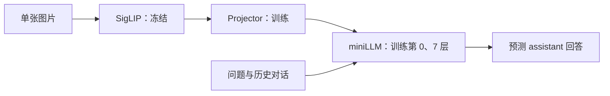

# miniLLM-vlm SFT 训练方案

本文介绍本项目在单张 RTX 4090 上进行视觉 SFT 的训练目标、模型适配策略、数据处理、参数设置和评估方法。SFT 继承已经完成的 Pretrain Projector，让语言模型进一步学习根据图片和用户问题组织回答。

**记录日期：2026-09-09。** 截至本文整理时，正式 Pretrain 已完成。

前置阶段见 [miniLLM-vlm Pretrain训练](miniLLM-vlm%20Pretrain训练.md)。全部训练代码由 `miniLLM-vlm` 独立维护。

## 1. 这次 SFT 要解决什么问题

Pretrain 的主要任务是让视觉特征成为语言模型能够利用的输入。完成对齐以后，模型仍需学习针对不同问题选择信息：同一张图片可以要求描述场景、回答主体属性，也可以根据上一轮对话继续解释。

SFT 使用带有目标回答的指令样本，让模型在图片、问题和历史对话的条件下预测 assistant 的回答。训练希望同时改善视觉问答、回答组织和指令遵循，并通过混合纯文本数据保留语言任务的训练覆盖。

本次继续使用原 Base、配套 tokenizer 和 SigLIP。模型的视觉分辨率和语言模型规模仍会限制能力；例如输入缩放时丢失的小字，不能仅靠增加 SFT 步数恢复。

### 1.1 为什么可以从当前 Pretrain 继续

正式 Pretrain 在固定验证样本上的结果如下：

| 指标 | 初始 | 最佳，也是最后一次验证 |
|---|---:|---:|
| 优化器更新步数 | 0 | 19681 |
| 验证语言损失 | 3.126354 | 2.681597 |
| 错配图片损失减正确图片损失 | 0.000530 | 0.306967 |
| 图片对照样本数 | 2000 | 2000 |

验证损失下降约 14.23%，图片对照差距明显扩大，支持 Projector 已经学会提供有用视觉条件的判断。它们不能换算成视觉问答准确率，也不能替代新图片上的描述检查，但足以支持进入 SFT 预检和短跑。

## 2. 采用首尾语言层适配

本项目从正式 Pretrain 权重初始化，继续训练 Projector，并解冻语言模型的首尾两层，让视觉表示和回答生成共同适应指令数据。训练采用 `5e-6` 的学习率和 768 的序列长度，正式实验先训练 1 轮建立基线。实现同时提供仅训练 Projector 和解冻全部语言层的选项，便于后续比较不同训练范围的成本与效果。

### 2.1 模型组成与可训练范围



Projector 保持 `LayerNorm → Linear → GELU → Linear`。图片经过 SigLIP 得到 64 个视觉向量，投影后替换文本序列中预留的图像位置。纯文本样本直接进入语言模型，跳过视觉编码器。

| 模块 | 本次状态 | 作用 |
|---|---|---|
| SigLIP | 冻结，保持 eval 模式 | 提取已有视觉特征 |
| Projector | 继续训练 | 调整视觉表示与语言输入之间的映射 |
| LLM 第 0 层 | 训练 | 适配进入语言网络的图文表示 |
| LLM 第 1～6 层 | 冻结 | 保留中间语言表示的已有权重 |
| LLM 第 7 层 | 训练 | 适配靠近输出的任务表示 |
| Embedding、末尾归一化、输出头 | 冻结 | 保持其已有参数 |

第 0、7 层是从 0 开始编号的首尾两个完整 decoder block，包含其中的注意力、归一化、MoE Router 和专家参数。这个选择是控制训练规模的起点，不意味着首尾层已经被证明是本模型的最优适配范围。

**冻结参数不等于切断反向传播。** 冻结的中间层仍需把梯度传回首层和 Projector，不能把整个语言模型放入 `no_grad()`。实现中只有视觉特征提取使用 `no_grad()`。

参数 `--freeze-llm` 的含义为：

| 值 | 训练范围 | 使用说明 |
|---|---|---|
| `1` | Projector + 首尾语言层 | 本次默认方案 |
| `0` | Projector + 全部语言模型 | 后续可比较，需重新测量显存与效果 |
| `2` | 仅 Projector | 本项目要求使用纯图文数据；含纯文本的 SFT 索引会被拒绝 |

本次模型共 **295,526,400** 个参数，其中 **49,557,504** 个可训练。Pretrain 只训练 1,182,720 个 Projector 参数，SFT 通过扩大可训练范围，让视觉表示与语言层共同适应指令任务。

### 2.2 初始化与续训是两种操作

第一次 SFT 使用 `--from-pretrain`：加载原 Base 和 SigLIP，再加载正式 Pretrain 的 Projector，创建新的优化器、学习率调度和 SwanLab 实验。

跨阶段加载会核对 Base、视觉资源、tokenizer 身份、VLM 配置、Projector 参数名、形状和有限值，并记录来源文件哈希和 Pretrain 步数。它允许 Pretrain 与 SFT 的实现版本不同，但不会跳过资源匹配检查。

`--resume` 则恢复已经生成的 SFT checkpoint，包括更新后的 LLM、Projector、优化器和训练位置。两者不能混为一谈：正式 SFT 不接着 smoke 的优化器状态训练，SFT 续训也不能只加载一个 Projector 文件。

## 3. 训练环境与资源组织

### 3.1 已验证的服务器环境

| 项目 | 本次配置 |
|---|---|
| GPU | NVIDIA GeForce RTX 4090，单卡 |
| CPU | 25 核 |
| 内存 | 90 GB |
| PyTorch | `2.3.0+cu121`，CUDA 可用 |
| 计算精度 | BF16 autocast，模型主参数保持 FP32 |
| Base | miniLLM，hidden size 768，8 层，词表 8192，4 个 MoE 专家 |
| 视觉编码器 | `model/siglips`，使用 `SiglipVisionModel` 加载 |
| 图像输入 | 256×256，patch size 32，64 个视觉位置 |

该配置已经通过本项目的 GPU 预检和短跑。

### 3.2 训练资源目录

本文使用示例路径：`/root/miniLLM-vlm` 表示代码目录，`/data/miniLLM-vlm` 表示数据与训练产物目录。执行命令前，请统一替换为服务器上的实际位置。

```text
/root/miniLLM-vlm/                         # 代码所在目录
├── model/miniLLM-base/                    # 原 Base 与配套 tokenizer
├── model/siglips/                         # 冻结视觉资源
└── out/pretrain_swanlab/best_adapter.pt    # 本次 SFT 的初始化来源

/data/miniLLM-vlm/                        # 数据与训练产物
├── dataset/sft_i2t.parquet                # 已下载的原始 SFT 数据
├── cache/arrow/                          # Hugging Face Arrow 缓存
├── cache/sft_smoke_index.json             # 短跑抽样索引
├── cache/sft_index.json                   # 全量扫描完成后的索引
├── checkpoints/sft/                      # 正式训练恢复断点
└── out/sft/                              # 推理权重、tokenizer 和日志
```

代码中的相对路径均相对 VLM 项目根目录解析。短跑与正式训练分别使用自己的索引、断点和输出目录，便于独立记录实验结果。

## 4. 数据方案：单图、多轮与纯文本混合

本次读取的 `sft_i2t.parquet` 共 **2,904,511 行**。这是原始行数，不是最终有效训练样本数，也不等于独立图片数量。正式训练还需过滤无效行并划出验证集。

### 4.1 对话与图片格式

Parquet 需要 `conversations` 和 `image_bytes` 两列。对话可以是 JSON 字符串或结构化列表，支持 `role/content`，也兼容 `from/value` 中的 `human/gpt` 角色名称。对话由可选 system 和完整的 user/assistant 对组成。

单图多轮对话示例：

```json
[
  {"role": "user", "content": "<image>\n请描述这张图片。"},
  {"role": "assistant", "content": "一只棕色小狗站在草地上。"},
  {"role": "user", "content": "小狗是什么颜色？"},
  {"role": "assistant", "content": "棕色。"}
]
```

唯一的 `<image>` 放在第一个 user 中，`image_bytes` 为对应图片字节或单元素字节列表。本版不支持多图和工具调用对话。

纯文本样本不带 `<image>`，图片列可以为空或保留不用的占位数据。若明确指定 `task_type=text`，实现会移除 user 中的图片占位标记并跳过图片。不会仅凭“图片是黑色”来猜测纯文本，避免误处理真实黑图。

可选 `task_type=instruction`、`caption` 用于分组统计。缺少这些字段时，图文统一记为 `image`。因此日志中 instruction/caption 数量为 0，不代表数据里没有对应任务。

本次直接使用已下载的 SFT 混合文件，没有再额外拼接 Pretrain 文件。短跑验证集实际识别出了 182 条图文和 18 条纯文本，说明两类样本均已进入验证流程；这不是全量数据的精确配比。

### 4.2 只监督 assistant 回答

本项目按 Base 的 ChatML 控制符组织序列，使用已有的 `<|reserved_0|>`（token ID 9）表示图像位置，不扩充词表。

| 序列内容 | 是否参与文字损失 |
|---|---|
| System、user、角色头 | 否，label 为 `-100` |
| 64 个图像位置 | 否，但 attention mask 为 1 |
| 每轮 assistant 正文和真实 EOS | 是 |
| Padding | 否，attention mask 为 0 |

最长 768 个位置包括图像、历史对话、问题和回答。截断保留对话前缀及第一张图；后续问题放不下时舍弃该轮和后续轮次，回答可在预算末尾截断，但不补造 EOS。首轮问题后放不下任何监督答案的行会被过滤。本版不把超长对话展开成多个滑动窗口样本。

### 4.3 图片划分沿用 Pretrain 规则

图片按原始字节 SHA-256、`seed=42` 和 `val_ratio=0.01` 决定属于训练侧还是验证侧。同一份图片字节对应的中英文或多轮样本落在同一侧；SFT 沿用相同规则，可避免同一图片在 Pretrain 与 SFT 中进入相反集合。

不同压缩、裁剪或重新编码的近重复图片不在该保证范围内。纯文本按结构化对话内容的序列化哈希划分，不能按所有文本共用的占位黑图划分。若 Pretrain 改过 seed 或验证比例，SFT 必须对应调整。

## 5. 优化器、学习率与训练节奏

| 参数 | 本次正式训练设置 |
|---|---|
| 训练轮数 | 1 |
| 单次前向 batch | 4 |
| 梯度累积 | 16 |
| 单卡有效 batch | `4 × 16 = 64` |
| 学习率 | `5e-6`，最低 `5e-7` |
| 调度 | 前 3% 更新步数 warmup，随后 cosine 衰减 |
| 优化器 | AdamW |
| Weight decay | 0.01，bias 和归一化参数不衰减 |
| 梯度裁剪 | 全部可训练参数的全局范数上限 1.0 |
| 数据加载 workers | 4 |
| 验证样本 | 固定抽取最多 2000 条 |
| 日志间隔 | 每 10 个优化器更新步 |
| 验证、保存间隔 | 每 500 个更新步，阶段结束时也执行 |

损失由 assistant 交叉熵和 Base 原有 Router 辅助项组成。交叉熵按每组累积更新中的有效监督 token 数加权，Router 辅助项只加入一次。日志分别报告两项，避免把语言预测的改善与辅助项混在一起。

SFT 学习率比本次 Pretrain 小，因为现在会调整已经训练好的语言层。先固定 batch 和学习率完成基线，避免同时改变训练范围、学习率和数据配比，使结果难以比较。

## 6. 训练实施流程

### 6.1 确认训练资源

```bash
cd /root/miniLLM-vlm

ls -lh /root/miniLLM-vlm/out/pretrain_swanlab/best_adapter.pt
ls -lh /data/miniLLM-vlm/dataset/sft_i2t.parquet
```

训练前准备好 Base、SigLIP、配套 tokenizer、正式 Pretrain 产物和 SFT 数据。启用 SwanLab 时，在服务器终端完成 `swanlab login`。

### 6.2 SFT 预检

```bash
python trainer/train_sft_vlm.py \
  --check-only \
  --device cuda \
  --samples 8 \
  --from-pretrain /root/miniLLM-vlm/out/pretrain_swanlab/best_adapter.pt \
  --data-path /data/miniLLM-vlm/dataset/sft_i2t.parquet \
  --cache-dir /data/miniLLM-vlm/cache \
  --report-path /data/miniLLM-vlm/out/sft_preflight.json
```

预检执行实际前向和反向，验证资源身份、冻结状态和梯度，不创建优化器、tracker 或训练 checkpoint。

本次实际输出：

| 项目 | 结果 |
|---|---|
| 初始化来源步数 | 19681 |
| 冻结检查 | passed |
| 输入形状 | `[8, 503]` |
| 检查样本 | 8 条图文，0 条纯文本 |
| 语言损失 | 2.681476 |
| Projector 梯度范数 | 0.431863 |
| LLM 梯度范数 | 1.185572 |
| CUDA 已分配显存峰值 | 约 3.47 GiB |

`data_stats: null` 表示没有执行完整索引扫描。`text_samples: 0` 只说明前 8 条没有纯文本，不能推断全量数据没有纯文本。预检显存也不包含完整训练中随后创建的优化器状态。

### 6.3 100 步短跑

```bash
python trainer/train_sft_vlm.py \
  --device cuda \
  --dtype bfloat16 \
  --from-pretrain /root/miniLLM-vlm/out/pretrain_swanlab/best_adapter.pt \
  --data-path /data/miniLLM-vlm/dataset/sft_i2t.parquet \
  --cache-dir /data/miniLLM-vlm/cache \
  --index-path /data/miniLLM-vlm/cache/sft_smoke_index.json \
  --freeze-llm 1 \
  --batch-size 4 \
  --accumulation-steps 16 \
  --max-seq-len 768 \
  --scan-samples 20000 \
  --max-train-samples 10000 \
  --max-steps 100 \
  --eval-samples 200 \
  --log-interval 10 \
  --eval-interval 50 \
  --save-interval 50 \
  --tracker swanlab \
  --tracker-project miniLLM-VLM-SFT \
  --tracker-run-name sft-smoke-4090 \
  --save-dir /data/miniLLM-vlm/checkpoints/sft_smoke \
  --output-dir /data/miniLLM-vlm/out/sft_smoke
```

`--scan-samples 20000` 固定随机选出 2 万行用于索引检查；`--max-train-samples 10000` 再限制有效训练集合；`--max-steps 100` 限制优化器更新次数。三者作用不同。

有效 batch 为 64 时，100 次完整更新实际处理约 6400 个样本，而不是把 1 万条全部训练一遍。短跑结束后等待 `Completed at step 100`，确认保存成功并返回命令提示符，再启动正式实验。

### 6.4 正式训练

```bash
cd /root/miniLLM-vlm

python trainer/train_sft_vlm.py \
  --device cuda \
  --dtype bfloat16 \
  --from-pretrain /root/miniLLM-vlm/out/pretrain_swanlab/best_adapter.pt \
  --data-path /data/miniLLM-vlm/dataset/sft_i2t.parquet \
  --cache-dir /data/miniLLM-vlm/cache \
  --index-path /data/miniLLM-vlm/cache/sft_index.json \
  --freeze-llm 1 \
  --epochs 1 \
  --max-seq-len 768 \
  --batch-size 4 \
  --accumulation-steps 16 \
  --learning-rate 5e-6 \
  --min-learning-rate 5e-7 \
  --warmup-ratio 0.03 \
  --num-workers 4 \
  --eval-samples 2000 \
  --log-interval 10 \
  --eval-interval 500 \
  --save-interval 500 \
  --tracker swanlab \
  --tracker-project miniLLM-VLM-SFT \
  --tracker-run-name sft-4090 \
  --save-dir /data/miniLLM-vlm/checkpoints/sft \
  --output-dir /data/miniLLM-vlm/out/sft
```

正式训练移除了短跑的抽样、训练样本上限和 100 步终点，使用独立索引与输出目录，从同一正式 Pretrain 产物重新初始化 SFT 调度。正式更新步数取决于过滤后的训练样本数，不能直接用原始 290 万行作为精确步数依据。

## 7. 数据预处理与索引方案

训练前先加载数据并建立有效样本索引。预处理核验图片能否解码、对话角色与轮次是否完整、图像标记位置是否正确，以及序列预算内是否保留了有效回答监督。无效样本会被过滤，并记录原因，便于检查数据质量。

索引保存有效行号、训练与验证划分及统计信息，图片仍由原始数据及 Arrow 数据集提供。固定的数据身份、分词器、长度、seed 和划分比例用于保证实验输入一致，配置发生变化时应建立对应的新索引。

短跑索引只检查固定抽取的 2 万行，用于验证训练链路；正式索引检查全量数据，用于完整训练。限制优化器更新步数与限制索引样本数是两个独立设置。当前实现会先加载完整数据，再进行索引抽样。

模型与数据准备完成后，记录初始验证结果，再执行参数更新。这样可以在同一验证设置下比较 SFT 前后的变化。

## 8. 短跑结果与 SwanLab 观察方法

### 8.1 本次 100 步的实际指标

验证样本固定为 200 条，包括 182 条图文和 18 条纯文本。

| 指标 | Step 0 | Step 50 | Step 100 |
|---|---:|---:|---:|
| 总体验证 loss | 2.582140 | 2.543748 | 2.531904 |
| 图文验证 loss | 2.700938 | 2.660738 | 2.650132 |
| 纯文本验证 loss | 1.888533 | 1.860694 | 1.841619 |
| 错配图片减正确图片 loss | 0.210671 | 0.193204 | 0.189858 |

总体验证 loss 下降约 1.95%，图文和纯文本均有改善。已记录更新的吞吐约 42～44 条/秒，CUDA 已分配显存峰值约 3.82 GiB，Projector 与 LLM 梯度均非零且有限。显存指标不等于 `nvidia-smi` 的进程总占用；吞吐不包含完整扫描、所有验证与保存时间，不能直接当作总训练耗时保证。

图片对照差距仍为正，但较初始缩小。语言层适配后，正确图和错误图下的损失都可能下降；仅凭差距变化无法断定视觉能力退化或提升，应结合图文损失和实际生成判断。纯文本验证只有 18 条，也不足以证明完整语言能力得到保留。

### 8.2 训练中看哪些曲线

SwanLab 项目为 `miniLLM-VLM-SFT`。初始化在索引完成后进行，扫描期间没有训练曲线是正常现象。

| 指标 | 观察用途 |
|---|---|
| `train/lm_loss`、`val/lm_loss` | 语言预测误差；不同 batch 的训练值会波动 |
| `val/visual_lm_loss` | 图文子集表现 |
| `val/text_lm_loss` | 纯文本子集表现，结合样本数解释 |
| `paired/wrong_minus_correct` | 正确图相对错配图是否提供帮助 |
| `train/projector_grad_norm`、`train/llm_grad_norm` | 两部分是否获得有效梯度 |
| `router/expert_*_fraction` | 观察专家使用分布是否发生异常集中 |
| `train/learning_rate` | 核对当前调度阶段 |
| `train/samples_per_second`、`train/peak_memory_gib` | 观察计算效率和显存 |

图片对照只在图文样本之间置换，并排除相同预处理图片。最佳模型按 `val/selection_loss` 选择：存在显式 instruction 分组时优先使用该组，否则使用全部图文损失；没有图文时才回退到总体损失。本次短跑没有显式 instruction/caption 元数据，因此使用图文损失。

每次验证还会生成固定样本的回答，默认 4 条、最多 64 个新 token，追加至 `out/sft/generations.jsonl`。这些文本保存在本地，当前实现未把它们上传 SwanLab。需人工检查主体、属性、幻觉、重复和回答是否符合问题。

## 9. 断点恢复与产物使用

### 9.1 保持训练轨迹一致

训练断点保存模型、优化器、学习率调度、随机状态和下一个 batch 位置。恢复时完整复用正式训练命令，在末尾追加 `--resume`，默认读取 `save-dir/latest.pt`。

恢复契约核对代码、资源、数据、训练范围、batch 和学习率调度，避免把不同实验混在一起。改变 epoch、学习率或训练步数上限时，应作为新实验记录。`--stop-after-steps` 可用于验证暂停与恢复，它不改变原有调度终点。

### 9.2 checkpoint 和推理文件的区别

| 产物 | 主要用途 |
|---|---|
| `checkpoints/sft/latest.pt`、`best.pt` | 恢复训练，含完整模型、优化器、scheduler、Scaler、RNG、进度及 tracker ID |
| `out/sft/best_sft.pt`、`last_sft.pt` | 推理，含完整更新后的 LLM、Projector、配置和资源身份 |
| `out/sft/tokenizer/` | 导出的配套 tokenizer；原 Base 文件保持不变 |
| `out/sft/run_config.json` | 记录参数、可训练参数清单、索引统计和恢复契约 |
| `out/sft/metrics.jsonl` | 本地数值日志 |
| `out/sft/generations.jsonl` | 固定问题、参考答案与生成回答 |

SFT 更新了语言层，所以最终推理不能只拿 Projector 配合原 Base。推理至少保留 `best_sft.pt`、配套 `tokenizer/` 和匹配的 SigLIP。SFT 推理加载器可直接从产物恢复完整 LLM，不需要原 Base 权重；训练续训仍按当前实现保留原始初始化资源。

## 10. 正式训练结束后如何评估

先确认终端报告 Completed 和实际结束步数，且 `best_sft.pt`、`last_sft.pt` 保存成功。不要仅凭最后一条验证日志就认为保存已经结束。

### 10.1 固定验证集评估

```bash
cd /root/miniLLM-vlm

python eval/eval_vlm.py \
  --device cuda \
  --dtype bfloat16 \
  --sft-model /data/miniLLM-vlm/out/sft/best_sft.pt \
  --vision-model /root/miniLLM-vlm/model/siglips \
  --data-path /data/miniLLM-vlm/dataset/sft_i2t.parquet \
  --cache-dir /data/miniLLM-vlm/cache \
  --index-path /data/miniLLM-vlm/cache/sft_index.json \
  --max-seq-len 768 \
  --seed 42 \
  --val-ratio 0.01 \
  --batch-size 4 \
  --eval-samples 2000 \
  --output /data/miniLLM-vlm/out/sft/evaluation_best.json
```

保持与训练相同的数据、划分、长度和评估 batch。batch 会影响错配图的配对方式，改动后差距不能当作完全相同的对照。可把模型路径换为 `last_sft.pt` 并使用另一个输出文件，比较最佳与最后的表现。

Pretrain 与 SFT 的数据、长度、样本集合及监督方式不同，不能直接拿两个阶段的 loss 绝对值比较能力。应比较同一 SFT 验证配置下的 step 0 与训练后结果。

### 10.2 图像问答与纯文本生成

将图片路径换成已上传的真实文件：

```bash
python eval/eval_vlm.py \
  --device cuda \
  --sft-model /data/miniLLM-vlm/out/sft/best_sft.pt \
  --vision-model /root/miniLLM-vlm/model/siglips \
  --image /data/miniLLM-vlm/images/example.jpg \
  --prompt '图片中有什么？请只描述你能看到的内容。' \
  --max-new-tokens 128

python eval/eval_vlm.py \
  --device cuda \
  --sft-model /data/miniLLM-vlm/out/sft/best_sft.pt \
  --vision-model /root/miniLLM-vlm/model/siglips \
  --text \
  --prompt '请用三句话介绍如何整理学习笔记。' \
  --max-new-tokens 128
```

多轮推理可用 `--messages` 读取以 user 结尾的 JSON 消息列表，与 `--image` 或 `--text` 同用。图像模式下若未写 `<image>`，入口会在第一个 user 中插入标记。

建议抽查未参与训练的图片，覆盖不同场景和中英文问题，记录主体、属性、数量、指令遵循、幻觉与重复。还应检查一组独立纯文本问题。固定 4 条生成记录便于跟踪变化，但不足以代表完整能力。

## 11. 本次实现与验证边界

| 文件 | 职责 |
|---|---|
| [train_sft_vlm.py](../../trainer/train_sft_vlm.py) | SFT 入口、预检、训练循环、保存与固定生成 |
| [model_vlm.py](../../model/model_vlm.py) | 模型组合、首尾层训练策略、图文/纯文本前向 |
| [vlm_dataset.py](../../dataset/vlm_dataset.py) | 多轮标签、混合 batch、划分和可恢复索引 |
| [trainer_utils.py](../../trainer/trainer_utils.py) | 资源校验、跨阶段初始化、SwanLab、评估与导出 |
| [train_pretrain_vlm.py](../../trainer/train_pretrain_vlm.py) | 共享参数解析和 token 加权更新函数 |
| [eval_vlm.py](../../eval/eval_vlm.py) | Pretrain 与 SFT 产物的评估和推理 |
| [test_sft_vlm.py](../../tests/test_sft_vlm.py) | SFT 离线回归测试 |

本地完整套件 15 项测试通过，包含原有 Pretrain 回归以及 SFT 的标签、冻结层、梯度累积、索引恢复、训练恢复和导出检查。隔离测试只复制 VLM 自身代码，在无父项目环境中运行。CPU 合成测试验证了非零 dropout 下，连续训练与暂停恢复后的 LLM/Projector 参数逐项一致。

训练服务器上进一步通过了真实 Base、SigLIP 和数据的 GPU 预检及 100 步训练、验证流程。正式全量训练质量仍需在完成后按上一节评估，不能仅由预检成功或短跑 loss 下降代替。
